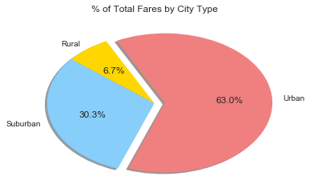

#Analysis

*For Urban & Suburban, the average fare vs volume of rides seems to cluster by city type.  Rural is more dispersed with volume of rides low but fares varying wildly.

*Urban cities dominated total fares, rides, and drivers.  However, the % of drivers is disproportionately high for Urban.

*There may be an opportunity to attempt to shift drivers toward Suburban -- the average fares are higher and there are likely better opportunities since urban drivers are relatively saturated (note, this is in relation to the other morphologies and would need further analysis to determine if that's a true statement).

#Setup


```python
import matplotlib.pyplot as plt
import pandas as pd
import os
import seaborn as sns
```

#Load in Datafiles & build the combined file


```python
file_name = os.path.join("Resources", "city_data.csv")
city_data = pd.read_csv(file_name)
file_name = os.path.join("Resources", "ride_data.csv")
ride_data = pd.read_csv(file_name)
```

#Clean the data


```python
#Needed to add this as a duplicate city (Port James) in the city_data was causing double counting of the ride data

cities=city_data.groupby("city").agg({"driver_count":'sum'})
cities.reset_index(level="city",inplace = True)
cities=pd.merge(cities,city_data,how="left", on="city")
cities=cities.rename(columns={"driver_count_x":"driver_count"})
cities=cities.drop("driver_count_y",axis=1)
cities.drop_duplicates(inplace=True)

#cities.head(100)
#cities.describe()
```

#Develop data necessary for bubble plot


```python
ride_share_data = pd.merge(ride_data, cities,
                                 how='outer', on='city')
#ride_share_data.head()
```


```python
data_by_city = ride_share_data.groupby("city")
```


```python
rides_by_city = data_by_city["ride_id"].count()
total_fares_by_city = data_by_city["fare"].sum()
average_fares_by_city = total_fares_by_city/rides_by_city

city_summary = pd.DataFrame({"ride_count":rides_by_city,
                            "average_fare":average_fares_by_city})

city_summary.reset_index(level="city",inplace = True)

city_summary_total = pd.merge(city_summary, cities,
                                 how='outer', on='city')

#format -- turns out that it won't plot once I format the $ :) -- left this in here in case I wanted to pretty it later
#city_summary_total["average_fare"] = city_summary_total["average_fare"].map("${0:,.2f}".format)

#city_summary_total.head()
```

#Added color to the dataframe for plotting, but it turned out that method didn't work for me when I tried to get the legend


```python
city_summary_total.loc[city_summary_total["type"]=="Urban","color"]="lightcoral"
city_summary_total.loc[city_summary_total["type"]=="Suburban","color"]="lightskyblue"
city_summary_total.loc[city_summary_total["type"]=="Rural","color"]="gold"
        
city_summary_total.head()
```


<div>
<style>
    .dataframe thead tr:only-child th {
        text-align: right;
    }

    .dataframe thead th {
        text-align: left;
    }

    .dataframe tbody tr th {
        vertical-align: top;
    }
</style>
<table border="1" class="dataframe">
  <thead>
    <tr style="text-align: right;">
      <th></th>
      <th>city</th>
      <th>average_fare</th>
      <th>ride_count</th>
      <th>driver_count</th>
      <th>type</th>
      <th>color</th>
    </tr>
  </thead>
  <tbody>
    <tr>
      <th>0</th>
      <td>Alvarezhaven</td>
      <td>23.928710</td>
      <td>31</td>
      <td>21</td>
      <td>Urban</td>
      <td>lightcoral</td>
    </tr>
    <tr>
      <th>1</th>
      <td>Alyssaberg</td>
      <td>20.609615</td>
      <td>26</td>
      <td>67</td>
      <td>Urban</td>
      <td>lightcoral</td>
    </tr>
    <tr>
      <th>2</th>
      <td>Anitamouth</td>
      <td>37.315556</td>
      <td>9</td>
      <td>16</td>
      <td>Suburban</td>
      <td>lightskyblue</td>
    </tr>
    <tr>
      <th>3</th>
      <td>Antoniomouth</td>
      <td>23.625000</td>
      <td>22</td>
      <td>21</td>
      <td>Urban</td>
      <td>lightcoral</td>
    </tr>
    <tr>
      <th>4</th>
      <td>Aprilchester</td>
      <td>21.981579</td>
      <td>19</td>
      <td>49</td>
      <td>Urban</td>
      <td>lightcoral</td>
    </tr>
  </tbody>
</table>
</div>


#Break out the data by city -- useful for now and for later


```python
urban_summary = city_summary_total.loc[city_summary_total["type"]=="Urban"]
suburban_summary = city_summary_total.loc[city_summary_total["type"]=="Suburban"]
rural_summary = city_summary_total.loc[city_summary_total["type"]=="Rural"]

rural_summary.head()
```


<div>
<style>
    .dataframe thead tr:only-child th {
        text-align: right;
    }

    .dataframe thead th {
        text-align: left;
    }

    .dataframe tbody tr th {
        vertical-align: top;
    }
</style>
<table border="1" class="dataframe">
  <thead>
    <tr style="text-align: right;">
      <th></th>
      <th>city</th>
      <th>average_fare</th>
      <th>ride_count</th>
      <th>driver_count</th>
      <th>type</th>
      <th>color</th>
    </tr>
  </thead>
  <tbody>
    <tr>
      <th>17</th>
      <td>East Leslie</td>
      <td>33.660909</td>
      <td>11</td>
      <td>9</td>
      <td>Rural</td>
      <td>gold</td>
    </tr>
    <tr>
      <th>18</th>
      <td>East Stephen</td>
      <td>39.053000</td>
      <td>10</td>
      <td>6</td>
      <td>Rural</td>
      <td>gold</td>
    </tr>
    <tr>
      <th>19</th>
      <td>East Troybury</td>
      <td>33.244286</td>
      <td>7</td>
      <td>3</td>
      <td>Rural</td>
      <td>gold</td>
    </tr>
    <tr>
      <th>21</th>
      <td>Erikport</td>
      <td>30.043750</td>
      <td>8</td>
      <td>3</td>
      <td>Rural</td>
      <td>gold</td>
    </tr>
    <tr>
      <th>25</th>
      <td>Hernandezshire</td>
      <td>32.002222</td>
      <td>9</td>
      <td>10</td>
      <td>Rural</td>
      <td>gold</td>
    </tr>
  </tbody>
</table>
</div>


#Create the bubble plot of the ride sharing data


```python
sns.set()
sns.axes_style()

plt.xlim(0, 40)
plt.ylim(15,45)

plt.title("Pyber Ride Sharing Data (2016)")
plt.xlabel("Total Number of Rides (Per City)")
plt.ylabel("Average Fare ($)")


#I'm not sure how long it took me to figure out to remove the comma after the handle for a scatter.  Yikes!
Urban_handle=plt.scatter(urban_summary["ride_count"], urban_summary["average_fare"], marker="o",facecolors="lightcoral",
            edgecolors="black", s=3*urban_summary["driver_count"], alpha=0.75, linewidths = 1.5,label="Urban")
Suburban_handle=plt.scatter(suburban_summary["ride_count"], suburban_summary["average_fare"], marker="o",
            facecolors="lightskyblue",edgecolors="black",s=3*suburban_summary["driver_count"],
            alpha=0.75,linewidths = 1.5,label="Suburban")
Rural_handle=plt.scatter(rural_summary["ride_count"], rural_summary["average_fare"], marker="o",
            facecolors="gold",edgecolors="black",s=3*rural_summary["driver_count"],
            alpha=0.75,linewidths = 1.5,label="Rural")


plt.legend(handles=[Urban_handle, Suburban_handle, Rural_handle], loc="upper right", fontsize = "small",title="City Types")

plt.figtext (1,.7,"Note:")
plt.figtext (1,.65,"Circle Size correlates with driver count per city.")

#I liked this method to plot, but then I couldn't figure out how to get the legend to work
#So I went back and plotted the city types individually to grab the handles.
#
#plt.scatter(city_summary_total["ride_count"], city_summary_total["average_fare"], marker="o",
#            facecolors=city_summary_total["color"],
#            edgecolors="black",s=3*city_summary_total["driver_count"], alpha=0.75,linewidths = 1.5)
#
#plt.legend(city_summary_total["type"],loc="upper right", fontsize = "small",title="City Types")
#Note:  legend command on the line above is not correct

plt.show()
```


#Breakout the ride share data by city type -- other dataframe only had average fare.
#I could have re-created but felt better using the raw fare data and summing versus multiplying average by ride count


```python
urban_summary_fare = ride_share_data.loc[ride_share_data["type"]=="Urban"]
suburban_summary_fare = ride_share_data.loc[ride_share_data["type"]=="Suburban"]
rural_summary_fare = ride_share_data.loc[ride_share_data["type"]=="Rural"]

total_urban_fares = urban_summary_fare["fare"].sum()
total_suburban_fares = suburban_summary_fare["fare"].sum()
total_rural_fares = rural_summary_fare["fare"].sum()
```

#Total Fares by City Type


```python
labels = ["Urban", "Rural", "Suburban"]

sizes = [total_urban_fares, total_rural_fares, total_suburban_fares]

colors = ["lightcoral", "gold", "lightskyblue"]

explode = (0.1, 0, 0)

plt.pie(sizes, explode=explode, labels=labels, colors=colors,
        autopct="%1.1f%%", shadow=True, startangle=250)

plt.title("% of Total Fares by City Type")
#plt.axis("equal")
plt.show()
```





#Total Rides by City Type


```python
total_urban_rides = urban_summary["ride_count"].sum()
total_suburban_rides = suburban_summary["ride_count"].sum()
total_rural_rides = rural_summary["ride_count"].sum()
```


```python
labels = ["Urban", "Rural", "Suburban"]

sizes = [total_urban_rides, total_rural_rides, total_suburban_rides]

colors = ["lightcoral", "gold", "lightskyblue"]

explode = (0.1, 0, 0)

plt.pie(sizes, explode=explode, labels=labels, colors=colors,
        autopct="%1.1f%%", shadow=True, startangle=250)

plt.title("% of Total Rides by City Type")

plt.show()
```


#Total Drivers by City Type


```python
total_urban_drivers = urban_summary["driver_count"].sum()
total_suburban_drivers = suburban_summary["driver_count"].sum()
total_rural_drivers = rural_summary["driver_count"].sum()
```


```python
labels = ["Urban", "Rural", "Suburban"]

sizes = [total_urban_drivers, total_rural_drivers, total_suburban_drivers]

colors = ["lightcoral", "gold", "lightskyblue"]

explode = (0.1, 0, 0)

plt.pie(sizes, explode=explode, labels=labels, colors=colors,
        autopct="%1.1f%%", shadow=True, startangle=230)

plt.title("% of Total Drivers by City Type")

plt.show()
```


