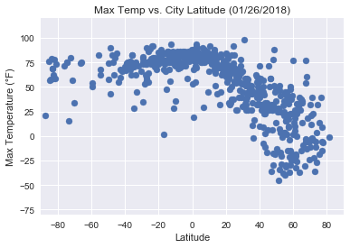
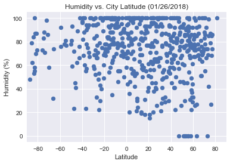
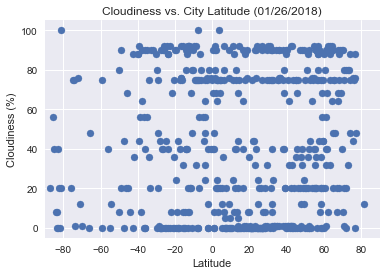
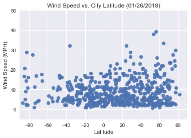

#Analysis

*We confirm, based on a single date sample, that max temp was higher for cities near the equator (0°)

*We can see the impact of winter in the Northern Hemisphere, as temperatures are signficantly lower traveling North

*From a visual inspection, cloudiness and humidity did not appear to vary significantly based on proximity to equator

*Windspeed did appear to be more extreme (higher) near the poles and more moderate (lower) near the equator

#Setup


```python
import json
import requests
import pandas as pd
import os
import numpy as np
import matplotlib.pyplot as plt
import seaborn as sns
from citipy import citipy
from time import sleep
import datetime

```

#Retreive API Key


```python
file_name = "../../ClassExamples/api_keys.json"
data = json.load(open(file_name))

owkey = data['open_weather_map_api_key']

```

#Develop City List


```python
city_list = []
lat_list = []

#cycle through in ranges of 10 degrees wide to ensure a good distribution across the latitudes
#since longitude isn't a dependent variable, I just let that be random across all 360 degrees
#from trial and error I decided to select 8 in each 10 degree band (it slides by 1 degree each time)
#this seems to ensure at least 500 cities (and I can confirm when I run that I get 500)
#probably could have looped until I had 500 unique, but this seemed to do the trick

for x in range (-90,81):
    for y in range (8):
        lat = np.random.uniform(x, x+10)
        lng = np.random.uniform(-180,180)
        city = citipy.nearest_city(lat, lng)
        city.city_name=city.city_name.replace(" ","+")
        city_list.append(city.city_name)
        lat_list.append(lat)

city_list_df=pd.DataFrame(city_list)
lat_list_df=pd.DataFrame(lat_list)

city_list_df.columns=["City"]
lat_list_df.columns=["Lat"]

city_list_df.drop_duplicates(inplace = True)
city_list_df["Lat"]=lat_list_df["Lat"]

city_list_df.shape
```


    (598, 2)


```python
city_list_df.head()
```


<div>
<style>
    .dataframe thead tr:only-child th {
        text-align: right;
    }

    .dataframe thead th {
        text-align: left;
    }

    .dataframe tbody tr th {
        vertical-align: top;
    }
</style>
<table border="1" class="dataframe">
  <thead>
    <tr style="text-align: right;">
      <th></th>
      <th>City</th>
      <th>Lat</th>
    </tr>
  </thead>
  <tbody>
    <tr>
      <th>0</th>
      <td>hermanus</td>
      <td>-83.703435</td>
    </tr>
    <tr>
      <th>1</th>
      <td>mataura</td>
      <td>-84.057807</td>
    </tr>
    <tr>
      <th>2</th>
      <td>albany</td>
      <td>-87.210521</td>
    </tr>
    <tr>
      <th>4</th>
      <td>ushuaia</td>
      <td>-84.844373</td>
    </tr>
    <tr>
      <th>5</th>
      <td>punta+arenas</td>
      <td>-82.690313</td>
    </tr>
  </tbody>
</table>
</div>


#Cycle through API calls to acquire weather data


```python
url = "http://api.openweathermap.org/data/2.5/weather?"
units = "imperial"
```


```python
weather_data = []
city_count = 1

for city in city_list_df["City"]:
    query_url = url + "appid=" + owkey + "&units=" + units + "&q=" + city
    print ("Processing City #"+str(city_count)+ ": "+city)
    print (query_url)
    city_count += 1
    response = requests.get(query_url).json()
    sleep(1)
    weather_data.append(response)
    try:
        maxtemp = weather_data[0]["main"]["temp_max"]
        humidity = weather_data[0]["main"]["humidity"]
        cloud = weather_data[0]["clouds"]["all"]
        windspeed = weather_data[0]["wind"]["speed"]
        date = weather_data[0]["dt"]
        city_list_df.loc[city_list_df["City"]==city,"Max Temp"]=maxtemp
        city_list_df.loc[city_list_df["City"]==city,"Cloudiness"]=cloud
        city_list_df.loc[city_list_df["City"]==city,"Humidity"]=humidity
        city_list_df.loc[city_list_df["City"]==city,"Wind Speed"]=windspeed
        city_list_df.loc[city_list_df["City"]==city,"Date"]=date
    except:
        print("error in retrieving data")
        weather_data=[]
        continue
        
    weather_data=[]
    
```

    Processing City #1: hermanus
    http://api.openweathermap.org/data/2.5/weather?appid=2cee94c368d90a739ff5bb7a4d3fa0d2&units=imperial&q=hermanus
    Processing City #2: mataura
    http://api.openweathermap.org/data/2.5/weather?appid=2cee94c368d90a739ff5bb7a4d3fa0d2&units=imperial&q=mataura
    Processing City #3: albany
    http://api.openweathermap.org/data/2.5/weather?appid=2cee94c368d90a739ff5bb7a4d3fa0d2&units=imperial&q=albany
    Processing City #4: ushuaia
    http://api.openweathermap.org/data/2.5/weather?appid=2cee94c368d90a739ff5bb7a4d3fa0d2&units=imperial&q=ushuaia
    Processing City #5: punta+arenas
    http://api.openweathermap.org/data/2.5/weather?appid=2cee94c368d90a739ff5bb7a4d3fa0d2&units=imperial&q=punta+arenas
    Processing City #6: bredasdorp
    http://api.openweathermap.org/data/2.5/weather?appid=2cee94c368d90a739ff5bb7a4d3fa0d2&units=imperial&q=bredasdorp
    Processing City #7: port+alfred
    http://api.openweathermap.org/data/2.5/weather?appid=2cee94c368d90a739ff5bb7a4d3fa0d2&units=imperial&q=port+alfred
    Processing City #8: hobart
    http://api.openweathermap.org/data/2.5/weather?appid=2cee94c368d90a739ff5bb7a4d3fa0d2&units=imperial&q=hobart
    Processing City #9: vaini
    http://api.openweathermap.org/data/2.5/weather?appid=2cee94c368d90a739ff5bb7a4d3fa0d2&units=imperial&q=vaini
    Processing City #10: new+norfolk
    http://api.openweathermap.org/data/2.5/weather?appid=2cee94c368d90a739ff5bb7a4d3fa0d2&units=imperial&q=new+norfolk
    Processing City #11: bluff
    http://api.openweathermap.org/data/2.5/weather?appid=2cee94c368d90a739ff5bb7a4d3fa0d2&units=imperial&q=bluff
    Processing City #12: busselton
    http://api.openweathermap.org/data/2.5/weather?appid=2cee94c368d90a739ff5bb7a4d3fa0d2&units=imperial&q=busselton
    Processing City #13: taolanaro
    http://api.openweathermap.org/data/2.5/weather?appid=2cee94c368d90a739ff5bb7a4d3fa0d2&units=imperial&q=taolanaro
    error in retrieving data
    Processing City #14: cape+town
    http://api.openweathermap.org/data/2.5/weather?appid=2cee94c368d90a739ff5bb7a4d3fa0d2&units=imperial&q=cape+town
    Processing City #15: saint-philippe
    http://api.openweathermap.org/data/2.5/weather?appid=2cee94c368d90a739ff5bb7a4d3fa0d2&units=imperial&q=saint-philippe
    Processing City #16: east+london
    http://api.openweathermap.org/data/2.5/weather?appid=2cee94c368d90a739ff5bb7a4d3fa0d2&units=imperial&q=east+london
    Processing City #17: rikitea
    http://api.openweathermap.org/data/2.5/weather?appid=2cee94c368d90a739ff5bb7a4d3fa0d2&units=imperial&q=rikitea
    Processing City #18: avarua
    http://api.openweathermap.org/data/2.5/weather?appid=2cee94c368d90a739ff5bb7a4d3fa0d2&units=imperial&q=avarua
    Processing City #19: kaitangata
    http://api.openweathermap.org/data/2.5/weather?appid=2cee94c368d90a739ff5bb7a4d3fa0d2&units=imperial&q=kaitangata
    Processing City #20: mar+del+plata
    http://api.openweathermap.org/data/2.5/weather?appid=2cee94c368d90a739ff5bb7a4d3fa0d2&units=imperial&q=mar+del+plata
    Processing City #21: chuy
    http://api.openweathermap.org/data/2.5/weather?appid=2cee94c368d90a739ff5bb7a4d3fa0d2&units=imperial&q=chuy
    Processing City #22: port+elizabeth
    http://api.openweathermap.org/data/2.5/weather?appid=2cee94c368d90a739ff5bb7a4d3fa0d2&units=imperial&q=port+elizabeth
    Processing City #23: dunedin
    http://api.openweathermap.org/data/2.5/weather?appid=2cee94c368d90a739ff5bb7a4d3fa0d2&units=imperial&q=dunedin
    Processing City #24: souillac
    http://api.openweathermap.org/data/2.5/weather?appid=2cee94c368d90a739ff5bb7a4d3fa0d2&units=imperial&q=souillac
    Processing City #25: tsihombe
    http://api.openweathermap.org/data/2.5/weather?appid=2cee94c368d90a739ff5bb7a4d3fa0d2&units=imperial&q=tsihombe
    error in retrieving data
    Processing City #26: tuatapere
    http://api.openweathermap.org/data/2.5/weather?appid=2cee94c368d90a739ff5bb7a4d3fa0d2&units=imperial&q=tuatapere
    Processing City #27: mahebourg
    http://api.openweathermap.org/data/2.5/weather?appid=2cee94c368d90a739ff5bb7a4d3fa0d2&units=imperial&q=mahebourg
    Processing City #28: port+lincoln
    http://api.openweathermap.org/data/2.5/weather?appid=2cee94c368d90a739ff5bb7a4d3fa0d2&units=imperial&q=port+lincoln
    Processing City #29: portland
    http://api.openweathermap.org/data/2.5/weather?appid=2cee94c368d90a739ff5bb7a4d3fa0d2&units=imperial&q=portland
    Processing City #30: castro
    http://api.openweathermap.org/data/2.5/weather?appid=2cee94c368d90a739ff5bb7a4d3fa0d2&units=imperial&q=castro
    Processing City #31: mount+gambier
    http://api.openweathermap.org/data/2.5/weather?appid=2cee94c368d90a739ff5bb7a4d3fa0d2&units=imperial&q=mount+gambier
    Processing City #32: arraial+do+cabo
    http://api.openweathermap.org/data/2.5/weather?appid=2cee94c368d90a739ff5bb7a4d3fa0d2&units=imperial&q=arraial+do+cabo
    Processing City #33: comodoro+rivadavia
    http://api.openweathermap.org/data/2.5/weather?appid=2cee94c368d90a739ff5bb7a4d3fa0d2&units=imperial&q=comodoro+rivadavia
    Processing City #34: esperance
    http://api.openweathermap.org/data/2.5/weather?appid=2cee94c368d90a739ff5bb7a4d3fa0d2&units=imperial&q=esperance
    Processing City #35: jamestown
    http://api.openweathermap.org/data/2.5/weather?appid=2cee94c368d90a739ff5bb7a4d3fa0d2&units=imperial&q=jamestown
    Processing City #36: coihaique
    http://api.openweathermap.org/data/2.5/weather?appid=2cee94c368d90a739ff5bb7a4d3fa0d2&units=imperial&q=coihaique
    Processing City #37: cidreira
    http://api.openweathermap.org/data/2.5/weather?appid=2cee94c368d90a739ff5bb7a4d3fa0d2&units=imperial&q=cidreira
    Processing City #38: umzimvubu
    http://api.openweathermap.org/data/2.5/weather?appid=2cee94c368d90a739ff5bb7a4d3fa0d2&units=imperial&q=umzimvubu
    error in retrieving data
    Processing City #39: rawson
    http://api.openweathermap.org/data/2.5/weather?appid=2cee94c368d90a739ff5bb7a4d3fa0d2&units=imperial&q=rawson
    Processing City #40: te+anau
    http://api.openweathermap.org/data/2.5/weather?appid=2cee94c368d90a739ff5bb7a4d3fa0d2&units=imperial&q=te+anau
    Processing City #41: batemans+bay
    http://api.openweathermap.org/data/2.5/weather?appid=2cee94c368d90a739ff5bb7a4d3fa0d2&units=imperial&q=batemans+bay
    Processing City #42: nelson+bay
    http://api.openweathermap.org/data/2.5/weather?appid=2cee94c368d90a739ff5bb7a4d3fa0d2&units=imperial&q=nelson+bay
    Processing City #43: wairoa
    http://api.openweathermap.org/data/2.5/weather?appid=2cee94c368d90a739ff5bb7a4d3fa0d2&units=imperial&q=wairoa
    Processing City #44: greymouth
    http://api.openweathermap.org/data/2.5/weather?appid=2cee94c368d90a739ff5bb7a4d3fa0d2&units=imperial&q=greymouth
    Processing City #45: ancud
    http://api.openweathermap.org/data/2.5/weather?appid=2cee94c368d90a739ff5bb7a4d3fa0d2&units=imperial&q=ancud
    Processing City #46: lebu
    http://api.openweathermap.org/data/2.5/weather?appid=2cee94c368d90a739ff5bb7a4d3fa0d2&units=imperial&q=lebu
    Processing City #47: karamea
    http://api.openweathermap.org/data/2.5/weather?appid=2cee94c368d90a739ff5bb7a4d3fa0d2&units=imperial&q=karamea
    error in retrieving data
    Processing City #48: rocha
    http://api.openweathermap.org/data/2.5/weather?appid=2cee94c368d90a739ff5bb7a4d3fa0d2&units=imperial&q=rocha
    Processing City #49: kruisfontein
    http://api.openweathermap.org/data/2.5/weather?appid=2cee94c368d90a739ff5bb7a4d3fa0d2&units=imperial&q=kruisfontein
    Processing City #50: lakes+entrance
    http://api.openweathermap.org/data/2.5/weather?appid=2cee94c368d90a739ff5bb7a4d3fa0d2&units=imperial&q=lakes+entrance
    Processing City #51: bambous+virieux
    http://api.openweathermap.org/data/2.5/weather?appid=2cee94c368d90a739ff5bb7a4d3fa0d2&units=imperial&q=bambous+virieux
    Processing City #52: san+rafael
    http://api.openweathermap.org/data/2.5/weather?appid=2cee94c368d90a739ff5bb7a4d3fa0d2&units=imperial&q=san+rafael
    Processing City #53: geraldton
    http://api.openweathermap.org/data/2.5/weather?appid=2cee94c368d90a739ff5bb7a4d3fa0d2&units=imperial&q=geraldton
    Processing City #54: ulladulla
    http://api.openweathermap.org/data/2.5/weather?appid=2cee94c368d90a739ff5bb7a4d3fa0d2&units=imperial&q=ulladulla
    Processing City #55: port+macquarie
    http://api.openweathermap.org/data/2.5/weather?appid=2cee94c368d90a739ff5bb7a4d3fa0d2&units=imperial&q=port+macquarie
    Processing City #56: corowa
    http://api.openweathermap.org/data/2.5/weather?appid=2cee94c368d90a739ff5bb7a4d3fa0d2&units=imperial&q=corowa
    Processing City #57: tandil
    http://api.openweathermap.org/data/2.5/weather?appid=2cee94c368d90a739ff5bb7a4d3fa0d2&units=imperial&q=tandil
    Processing City #58: necochea
    http://api.openweathermap.org/data/2.5/weather?appid=2cee94c368d90a739ff5bb7a4d3fa0d2&units=imperial&q=necochea
    Processing City #59: griffith
    http://api.openweathermap.org/data/2.5/weather?appid=2cee94c368d90a739ff5bb7a4d3fa0d2&units=imperial&q=griffith
    Processing City #60: luderitz
    http://api.openweathermap.org/data/2.5/weather?appid=2cee94c368d90a739ff5bb7a4d3fa0d2&units=imperial&q=luderitz
    Processing City #61: dargaville
    http://api.openweathermap.org/data/2.5/weather?appid=2cee94c368d90a739ff5bb7a4d3fa0d2&units=imperial&q=dargaville
    Processing City #62: port+augusta
    http://api.openweathermap.org/data/2.5/weather?appid=2cee94c368d90a739ff5bb7a4d3fa0d2&units=imperial&q=port+augusta
    Processing City #63: julio+de+castilhos
    http://api.openweathermap.org/data/2.5/weather?appid=2cee94c368d90a739ff5bb7a4d3fa0d2&units=imperial&q=julio+de+castilhos
    Processing City #64: moree
    http://api.openweathermap.org/data/2.5/weather?appid=2cee94c368d90a739ff5bb7a4d3fa0d2&units=imperial&q=moree
    Processing City #65: vao
    http://api.openweathermap.org/data/2.5/weather?appid=2cee94c368d90a739ff5bb7a4d3fa0d2&units=imperial&q=vao
    Processing City #66: vallenar
    http://api.openweathermap.org/data/2.5/weather?appid=2cee94c368d90a739ff5bb7a4d3fa0d2&units=imperial&q=vallenar
    Processing City #67: gold+coast
    http://api.openweathermap.org/data/2.5/weather?appid=2cee94c368d90a739ff5bb7a4d3fa0d2&units=imperial&q=gold+coast
    Processing City #68: kathu
    http://api.openweathermap.org/data/2.5/weather?appid=2cee94c368d90a739ff5bb7a4d3fa0d2&units=imperial&q=kathu
    Processing City #69: imbituba
    http://api.openweathermap.org/data/2.5/weather?appid=2cee94c368d90a739ff5bb7a4d3fa0d2&units=imperial&q=imbituba
    Processing City #70: yulara
    http://api.openweathermap.org/data/2.5/weather?appid=2cee94c368d90a739ff5bb7a4d3fa0d2&units=imperial&q=yulara
    Processing City #71: pisco
    http://api.openweathermap.org/data/2.5/weather?appid=2cee94c368d90a739ff5bb7a4d3fa0d2&units=imperial&q=pisco
    Processing City #72: oranjemund
    http://api.openweathermap.org/data/2.5/weather?appid=2cee94c368d90a739ff5bb7a4d3fa0d2&units=imperial&q=oranjemund
    Processing City #73: kaeo
    http://api.openweathermap.org/data/2.5/weather?appid=2cee94c368d90a739ff5bb7a4d3fa0d2&units=imperial&q=kaeo
    Processing City #74: flinders
    http://api.openweathermap.org/data/2.5/weather?appid=2cee94c368d90a739ff5bb7a4d3fa0d2&units=imperial&q=flinders
    Processing City #75: avera
    http://api.openweathermap.org/data/2.5/weather?appid=2cee94c368d90a739ff5bb7a4d3fa0d2&units=imperial&q=avera
    Processing City #76: san+martin
    http://api.openweathermap.org/data/2.5/weather?appid=2cee94c368d90a739ff5bb7a4d3fa0d2&units=imperial&q=san+martin
    Processing City #77: ahipara
    http://api.openweathermap.org/data/2.5/weather?appid=2cee94c368d90a739ff5bb7a4d3fa0d2&units=imperial&q=ahipara
    Processing City #78: taltal
    http://api.openweathermap.org/data/2.5/weather?appid=2cee94c368d90a739ff5bb7a4d3fa0d2&units=imperial&q=taltal
    Processing City #79: coquimbo
    http://api.openweathermap.org/data/2.5/weather?appid=2cee94c368d90a739ff5bb7a4d3fa0d2&units=imperial&q=coquimbo
    Processing City #80: san+antonio
    http://api.openweathermap.org/data/2.5/weather?appid=2cee94c368d90a739ff5bb7a4d3fa0d2&units=imperial&q=san+antonio
    Processing City #81: walvis+bay
    http://api.openweathermap.org/data/2.5/weather?appid=2cee94c368d90a739ff5bb7a4d3fa0d2&units=imperial&q=walvis+bay
    Processing City #82: isangel
    http://api.openweathermap.org/data/2.5/weather?appid=2cee94c368d90a739ff5bb7a4d3fa0d2&units=imperial&q=isangel
    Processing City #83: sao+joao+da+barra
    http://api.openweathermap.org/data/2.5/weather?appid=2cee94c368d90a739ff5bb7a4d3fa0d2&units=imperial&q=sao+joao+da+barra
    Processing City #84: coolum+beach
    http://api.openweathermap.org/data/2.5/weather?appid=2cee94c368d90a739ff5bb7a4d3fa0d2&units=imperial&q=coolum+beach
    Processing City #85: mookane
    http://api.openweathermap.org/data/2.5/weather?appid=2cee94c368d90a739ff5bb7a4d3fa0d2&units=imperial&q=mookane
    Processing City #86: vila+velha
    http://api.openweathermap.org/data/2.5/weather?appid=2cee94c368d90a739ff5bb7a4d3fa0d2&units=imperial&q=vila+velha
    Processing City #87: roma
    http://api.openweathermap.org/data/2.5/weather?appid=2cee94c368d90a739ff5bb7a4d3fa0d2&units=imperial&q=roma
    Processing City #88: carnarvon
    http://api.openweathermap.org/data/2.5/weather?appid=2cee94c368d90a739ff5bb7a4d3fa0d2&units=imperial&q=carnarvon
    Processing City #89: koumac
    http://api.openweathermap.org/data/2.5/weather?appid=2cee94c368d90a739ff5bb7a4d3fa0d2&units=imperial&q=koumac
    Processing City #90: maun
    http://api.openweathermap.org/data/2.5/weather?appid=2cee94c368d90a739ff5bb7a4d3fa0d2&units=imperial&q=maun
    Processing City #91: puerto+pinasco
    http://api.openweathermap.org/data/2.5/weather?appid=2cee94c368d90a739ff5bb7a4d3fa0d2&units=imperial&q=puerto+pinasco
    error in retrieving data
    Processing City #92: tocopilla
    http://api.openweathermap.org/data/2.5/weather?appid=2cee94c368d90a739ff5bb7a4d3fa0d2&units=imperial&q=tocopilla
    Processing City #93: alofi
    http://api.openweathermap.org/data/2.5/weather?appid=2cee94c368d90a739ff5bb7a4d3fa0d2&units=imperial&q=alofi
    Processing City #94: maltahohe
    http://api.openweathermap.org/data/2.5/weather?appid=2cee94c368d90a739ff5bb7a4d3fa0d2&units=imperial&q=maltahohe
    Processing City #95: puerto+ayora
    http://api.openweathermap.org/data/2.5/weather?appid=2cee94c368d90a739ff5bb7a4d3fa0d2&units=imperial&q=puerto+ayora
    Processing City #96: itapecerica
    http://api.openweathermap.org/data/2.5/weather?appid=2cee94c368d90a739ff5bb7a4d3fa0d2&units=imperial&q=itapecerica
    Processing City #97: iquique
    http://api.openweathermap.org/data/2.5/weather?appid=2cee94c368d90a739ff5bb7a4d3fa0d2&units=imperial&q=iquique
    Processing City #98: ngukurr
    http://api.openweathermap.org/data/2.5/weather?appid=2cee94c368d90a739ff5bb7a4d3fa0d2&units=imperial&q=ngukurr
    error in retrieving data
    Processing City #99: cajati
    http://api.openweathermap.org/data/2.5/weather?appid=2cee94c368d90a739ff5bb7a4d3fa0d2&units=imperial&q=cajati
    Processing City #100: angoche
    http://api.openweathermap.org/data/2.5/weather?appid=2cee94c368d90a739ff5bb7a4d3fa0d2&units=imperial&q=angoche
    Processing City #101: saint-joseph
    http://api.openweathermap.org/data/2.5/weather?appid=2cee94c368d90a739ff5bb7a4d3fa0d2&units=imperial&q=saint-joseph
    Processing City #102: henties+bay
    http://api.openweathermap.org/data/2.5/weather?appid=2cee94c368d90a739ff5bb7a4d3fa0d2&units=imperial&q=henties+bay
    Processing City #103: caravelas
    http://api.openweathermap.org/data/2.5/weather?appid=2cee94c368d90a739ff5bb7a4d3fa0d2&units=imperial&q=caravelas
    Processing City #104: morondava
    http://api.openweathermap.org/data/2.5/weather?appid=2cee94c368d90a739ff5bb7a4d3fa0d2&units=imperial&q=morondava
    Processing City #105: innisfail
    http://api.openweathermap.org/data/2.5/weather?appid=2cee94c368d90a739ff5bb7a4d3fa0d2&units=imperial&q=innisfail
    Processing City #106: ilhabela
    http://api.openweathermap.org/data/2.5/weather?appid=2cee94c368d90a739ff5bb7a4d3fa0d2&units=imperial&q=ilhabela
    Processing City #107: doctor+pedro+p.+pena
    http://api.openweathermap.org/data/2.5/weather?appid=2cee94c368d90a739ff5bb7a4d3fa0d2&units=imperial&q=doctor+pedro+p.+pena
    error in retrieving data
    Processing City #108: teahupoo
    http://api.openweathermap.org/data/2.5/weather?appid=2cee94c368d90a739ff5bb7a4d3fa0d2&units=imperial&q=teahupoo
    Processing City #109: haapiti
    http://api.openweathermap.org/data/2.5/weather?appid=2cee94c368d90a739ff5bb7a4d3fa0d2&units=imperial&q=haapiti
    Processing City #110: port+hedland
    http://api.openweathermap.org/data/2.5/weather?appid=2cee94c368d90a739ff5bb7a4d3fa0d2&units=imperial&q=port+hedland
    Processing City #111: mount+isa
    http://api.openweathermap.org/data/2.5/weather?appid=2cee94c368d90a739ff5bb7a4d3fa0d2&units=imperial&q=mount+isa
    Processing City #112: luganville
    http://api.openweathermap.org/data/2.5/weather?appid=2cee94c368d90a739ff5bb7a4d3fa0d2&units=imperial&q=luganville
    Processing City #113: hithadhoo
    http://api.openweathermap.org/data/2.5/weather?appid=2cee94c368d90a739ff5bb7a4d3fa0d2&units=imperial&q=hithadhoo
    Processing City #114: palabuhanratu
    http://api.openweathermap.org/data/2.5/weather?appid=2cee94c368d90a739ff5bb7a4d3fa0d2&units=imperial&q=palabuhanratu
    error in retrieving data
    Processing City #115: georgetown
    http://api.openweathermap.org/data/2.5/weather?appid=2cee94c368d90a739ff5bb7a4d3fa0d2&units=imperial&q=georgetown
    Processing City #116: bengkulu
    http://api.openweathermap.org/data/2.5/weather?appid=2cee94c368d90a739ff5bb7a4d3fa0d2&units=imperial&q=bengkulu
    error in retrieving data
    Processing City #117: belmonte
    http://api.openweathermap.org/data/2.5/weather?appid=2cee94c368d90a739ff5bb7a4d3fa0d2&units=imperial&q=belmonte
    Processing City #118: san+ramon
    http://api.openweathermap.org/data/2.5/weather?appid=2cee94c368d90a739ff5bb7a4d3fa0d2&units=imperial&q=san+ramon
    Processing City #119: bambanglipuro
    http://api.openweathermap.org/data/2.5/weather?appid=2cee94c368d90a739ff5bb7a4d3fa0d2&units=imperial&q=bambanglipuro
    Processing City #120: fare
    http://api.openweathermap.org/data/2.5/weather?appid=2cee94c368d90a739ff5bb7a4d3fa0d2&units=imperial&q=fare
    Processing City #121: grand+river+south+east
    http://api.openweathermap.org/data/2.5/weather?appid=2cee94c368d90a739ff5bb7a4d3fa0d2&units=imperial&q=grand+river+south+east
    error in retrieving data
    Processing City #122: sambava
    http://api.openweathermap.org/data/2.5/weather?appid=2cee94c368d90a739ff5bb7a4d3fa0d2&units=imperial&q=sambava
    Processing City #123: pontes+e+lacerda
    http://api.openweathermap.org/data/2.5/weather?appid=2cee94c368d90a739ff5bb7a4d3fa0d2&units=imperial&q=pontes+e+lacerda
    Processing City #124: atuona
    http://api.openweathermap.org/data/2.5/weather?appid=2cee94c368d90a739ff5bb7a4d3fa0d2&units=imperial&q=atuona
    Processing City #125: luziania
    http://api.openweathermap.org/data/2.5/weather?appid=2cee94c368d90a739ff5bb7a4d3fa0d2&units=imperial&q=luziania
    Processing City #126: pau+brasil
    http://api.openweathermap.org/data/2.5/weather?appid=2cee94c368d90a739ff5bb7a4d3fa0d2&units=imperial&q=pau+brasil
    Processing City #127: ambodifototra
    http://api.openweathermap.org/data/2.5/weather?appid=2cee94c368d90a739ff5bb7a4d3fa0d2&units=imperial&q=ambodifototra
    error in retrieving data
    Processing City #128: namibe
    http://api.openweathermap.org/data/2.5/weather?appid=2cee94c368d90a739ff5bb7a4d3fa0d2&units=imperial&q=namibe
    Processing City #129: taiobeiras
    http://api.openweathermap.org/data/2.5/weather?appid=2cee94c368d90a739ff5bb7a4d3fa0d2&units=imperial&q=taiobeiras
    Processing City #130: san+matias
    http://api.openweathermap.org/data/2.5/weather?appid=2cee94c368d90a739ff5bb7a4d3fa0d2&units=imperial&q=san+matias
    Processing City #131: cairns
    http://api.openweathermap.org/data/2.5/weather?appid=2cee94c368d90a739ff5bb7a4d3fa0d2&units=imperial&q=cairns
    Processing City #132: lakatoro
    http://api.openweathermap.org/data/2.5/weather?appid=2cee94c368d90a739ff5bb7a4d3fa0d2&units=imperial&q=lakatoro
    Processing City #133: campos+altos
    http://api.openweathermap.org/data/2.5/weather?appid=2cee94c368d90a739ff5bb7a4d3fa0d2&units=imperial&q=campos+altos
    Processing City #134: hihifo
    http://api.openweathermap.org/data/2.5/weather?appid=2cee94c368d90a739ff5bb7a4d3fa0d2&units=imperial&q=hihifo
    error in retrieving data
    Processing City #135: lata
    http://api.openweathermap.org/data/2.5/weather?appid=2cee94c368d90a739ff5bb7a4d3fa0d2&units=imperial&q=lata
    Processing City #136: faanui
    http://api.openweathermap.org/data/2.5/weather?appid=2cee94c368d90a739ff5bb7a4d3fa0d2&units=imperial&q=faanui
    Processing City #137: ambanja
    http://api.openweathermap.org/data/2.5/weather?appid=2cee94c368d90a739ff5bb7a4d3fa0d2&units=imperial&q=ambanja
    Processing City #138: macusani
    http://api.openweathermap.org/data/2.5/weather?appid=2cee94c368d90a739ff5bb7a4d3fa0d2&units=imperial&q=macusani
    Processing City #139: waingapu
    http://api.openweathermap.org/data/2.5/weather?appid=2cee94c368d90a739ff5bb7a4d3fa0d2&units=imperial&q=waingapu
    Processing City #140: cap+malheureux
    http://api.openweathermap.org/data/2.5/weather?appid=2cee94c368d90a739ff5bb7a4d3fa0d2&units=imperial&q=cap+malheureux
    Processing City #141: nhulunbuy
    http://api.openweathermap.org/data/2.5/weather?appid=2cee94c368d90a739ff5bb7a4d3fa0d2&units=imperial&q=nhulunbuy
    Processing City #142: sechura
    http://api.openweathermap.org/data/2.5/weather?appid=2cee94c368d90a739ff5bb7a4d3fa0d2&units=imperial&q=sechura
    Processing City #143: inhambupe
    http://api.openweathermap.org/data/2.5/weather?appid=2cee94c368d90a739ff5bb7a4d3fa0d2&units=imperial&q=inhambupe
    Processing City #144: nacala
    http://api.openweathermap.org/data/2.5/weather?appid=2cee94c368d90a739ff5bb7a4d3fa0d2&units=imperial&q=nacala
    Processing City #145: morros
    http://api.openweathermap.org/data/2.5/weather?appid=2cee94c368d90a739ff5bb7a4d3fa0d2&units=imperial&q=morros
    Processing City #146: porto+velho
    http://api.openweathermap.org/data/2.5/weather?appid=2cee94c368d90a739ff5bb7a4d3fa0d2&units=imperial&q=porto+velho
    Processing City #147: ambilobe
    http://api.openweathermap.org/data/2.5/weather?appid=2cee94c368d90a739ff5bb7a4d3fa0d2&units=imperial&q=ambilobe
    Processing City #148: kupang
    http://api.openweathermap.org/data/2.5/weather?appid=2cee94c368d90a739ff5bb7a4d3fa0d2&units=imperial&q=kupang
    Processing City #149: mocambique
    http://api.openweathermap.org/data/2.5/weather?appid=2cee94c368d90a739ff5bb7a4d3fa0d2&units=imperial&q=mocambique
    error in retrieving data
    Processing City #150: maracas
    http://api.openweathermap.org/data/2.5/weather?appid=2cee94c368d90a739ff5bb7a4d3fa0d2&units=imperial&q=maracas
    Processing City #151: chissamba
    http://api.openweathermap.org/data/2.5/weather?appid=2cee94c368d90a739ff5bb7a4d3fa0d2&units=imperial&q=chissamba
    error in retrieving data
    Processing City #152: samusu
    http://api.openweathermap.org/data/2.5/weather?appid=2cee94c368d90a739ff5bb7a4d3fa0d2&units=imperial&q=samusu
    error in retrieving data
    Processing City #153: nabire
    http://api.openweathermap.org/data/2.5/weather?appid=2cee94c368d90a739ff5bb7a4d3fa0d2&units=imperial&q=nabire
    Processing City #154: praya
    http://api.openweathermap.org/data/2.5/weather?appid=2cee94c368d90a739ff5bb7a4d3fa0d2&units=imperial&q=praya
    Processing City #155: daru
    http://api.openweathermap.org/data/2.5/weather?appid=2cee94c368d90a739ff5bb7a4d3fa0d2&units=imperial&q=daru
    Processing City #156: iberia
    http://api.openweathermap.org/data/2.5/weather?appid=2cee94c368d90a739ff5bb7a4d3fa0d2&units=imperial&q=iberia
    Processing City #157: indiaroba
    http://api.openweathermap.org/data/2.5/weather?appid=2cee94c368d90a739ff5bb7a4d3fa0d2&units=imperial&q=indiaroba
    Processing City #158: padang
    http://api.openweathermap.org/data/2.5/weather?appid=2cee94c368d90a739ff5bb7a4d3fa0d2&units=imperial&q=padang
    Processing City #159: asau
    http://api.openweathermap.org/data/2.5/weather?appid=2cee94c368d90a739ff5bb7a4d3fa0d2&units=imperial&q=asau
    error in retrieving data
    Processing City #160: buin
    http://api.openweathermap.org/data/2.5/weather?appid=2cee94c368d90a739ff5bb7a4d3fa0d2&units=imperial&q=buin
    Processing City #161: gondanglegi
    http://api.openweathermap.org/data/2.5/weather?appid=2cee94c368d90a739ff5bb7a4d3fa0d2&units=imperial&q=gondanglegi
    Processing City #162: tamandare
    http://api.openweathermap.org/data/2.5/weather?appid=2cee94c368d90a739ff5bb7a4d3fa0d2&units=imperial&q=tamandare
    Processing City #163: hualmay
    http://api.openweathermap.org/data/2.5/weather?appid=2cee94c368d90a739ff5bb7a4d3fa0d2&units=imperial&q=hualmay
    Processing City #164: santo+antonio+do+ica
    http://api.openweathermap.org/data/2.5/weather?appid=2cee94c368d90a739ff5bb7a4d3fa0d2&units=imperial&q=santo+antonio+do+ica
    Processing City #165: touros
    http://api.openweathermap.org/data/2.5/weather?appid=2cee94c368d90a739ff5bb7a4d3fa0d2&units=imperial&q=touros
    Processing City #166: cabedelo
    http://api.openweathermap.org/data/2.5/weather?appid=2cee94c368d90a739ff5bb7a4d3fa0d2&units=imperial&q=cabedelo
    Processing City #167: reriutaba
    http://api.openweathermap.org/data/2.5/weather?appid=2cee94c368d90a739ff5bb7a4d3fa0d2&units=imperial&q=reriutaba
    Processing City #168: tabou
    http://api.openweathermap.org/data/2.5/weather?appid=2cee94c368d90a739ff5bb7a4d3fa0d2&units=imperial&q=tabou
    Processing City #169: ruteng
    http://api.openweathermap.org/data/2.5/weather?appid=2cee94c368d90a739ff5bb7a4d3fa0d2&units=imperial&q=ruteng
    Processing City #170: san+cristobal
    http://api.openweathermap.org/data/2.5/weather?appid=2cee94c368d90a739ff5bb7a4d3fa0d2&units=imperial&q=san+cristobal
    Processing City #171: sola
    http://api.openweathermap.org/data/2.5/weather?appid=2cee94c368d90a739ff5bb7a4d3fa0d2&units=imperial&q=sola
    Processing City #172: paita
    http://api.openweathermap.org/data/2.5/weather?appid=2cee94c368d90a739ff5bb7a4d3fa0d2&units=imperial&q=paita
    Processing City #173: sikonge
    http://api.openweathermap.org/data/2.5/weather?appid=2cee94c368d90a739ff5bb7a4d3fa0d2&units=imperial&q=sikonge
    Processing City #174: pitimbu
    http://api.openweathermap.org/data/2.5/weather?appid=2cee94c368d90a739ff5bb7a4d3fa0d2&units=imperial&q=pitimbu
    Processing City #175: takoradi
    http://api.openweathermap.org/data/2.5/weather?appid=2cee94c368d90a739ff5bb7a4d3fa0d2&units=imperial&q=takoradi
    Processing City #176: karema
    http://api.openweathermap.org/data/2.5/weather?appid=2cee94c368d90a739ff5bb7a4d3fa0d2&units=imperial&q=karema
    Processing City #177: popondetta
    http://api.openweathermap.org/data/2.5/weather?appid=2cee94c368d90a739ff5bb7a4d3fa0d2&units=imperial&q=popondetta
    Processing City #178: mendahara
    http://api.openweathermap.org/data/2.5/weather?appid=2cee94c368d90a739ff5bb7a4d3fa0d2&units=imperial&q=mendahara
    error in retrieving data
    Processing City #179: tutoia
    http://api.openweathermap.org/data/2.5/weather?appid=2cee94c368d90a739ff5bb7a4d3fa0d2&units=imperial&q=tutoia
    Processing City #180: jacareacanga
    http://api.openweathermap.org/data/2.5/weather?appid=2cee94c368d90a739ff5bb7a4d3fa0d2&units=imperial&q=jacareacanga
    Processing City #181: bukama
    http://api.openweathermap.org/data/2.5/weather?appid=2cee94c368d90a739ff5bb7a4d3fa0d2&units=imperial&q=bukama
    Processing City #182: victoria
    http://api.openweathermap.org/data/2.5/weather?appid=2cee94c368d90a739ff5bb7a4d3fa0d2&units=imperial&q=victoria
    Processing City #183: nauta
    http://api.openweathermap.org/data/2.5/weather?appid=2cee94c368d90a739ff5bb7a4d3fa0d2&units=imperial&q=nauta
    Processing City #184: thinadhoo
    http://api.openweathermap.org/data/2.5/weather?appid=2cee94c368d90a739ff5bb7a4d3fa0d2&units=imperial&q=thinadhoo
    Processing City #185: puerto+narino
    http://api.openweathermap.org/data/2.5/weather?appid=2cee94c368d90a739ff5bb7a4d3fa0d2&units=imperial&q=puerto+narino
    Processing City #186: tabiauea
    http://api.openweathermap.org/data/2.5/weather?appid=2cee94c368d90a739ff5bb7a4d3fa0d2&units=imperial&q=tabiauea
    error in retrieving data
    Processing City #187: ipixuna
    http://api.openweathermap.org/data/2.5/weather?appid=2cee94c368d90a739ff5bb7a4d3fa0d2&units=imperial&q=ipixuna
    Processing City #188: port-gentil
    http://api.openweathermap.org/data/2.5/weather?appid=2cee94c368d90a739ff5bb7a4d3fa0d2&units=imperial&q=port-gentil
    Processing City #189: kavieng
    http://api.openweathermap.org/data/2.5/weather?appid=2cee94c368d90a739ff5bb7a4d3fa0d2&units=imperial&q=kavieng
    Processing City #190: boa+vista
    http://api.openweathermap.org/data/2.5/weather?appid=2cee94c368d90a739ff5bb7a4d3fa0d2&units=imperial&q=boa+vista
    Processing City #191: yantzaza
    http://api.openweathermap.org/data/2.5/weather?appid=2cee94c368d90a739ff5bb7a4d3fa0d2&units=imperial&q=yantzaza
    Processing City #192: inongo
    http://api.openweathermap.org/data/2.5/weather?appid=2cee94c368d90a739ff5bb7a4d3fa0d2&units=imperial&q=inongo
    Processing City #193: mugumu
    http://api.openweathermap.org/data/2.5/weather?appid=2cee94c368d90a739ff5bb7a4d3fa0d2&units=imperial&q=mugumu
    Processing City #194: temaraia
    http://api.openweathermap.org/data/2.5/weather?appid=2cee94c368d90a739ff5bb7a4d3fa0d2&units=imperial&q=temaraia
    error in retrieving data
    Processing City #195: san+patricio
    http://api.openweathermap.org/data/2.5/weather?appid=2cee94c368d90a739ff5bb7a4d3fa0d2&units=imperial&q=san+patricio
    Processing City #196: saleaula
    http://api.openweathermap.org/data/2.5/weather?appid=2cee94c368d90a739ff5bb7a4d3fa0d2&units=imperial&q=saleaula
    error in retrieving data
    Processing City #197: kijang
    http://api.openweathermap.org/data/2.5/weather?appid=2cee94c368d90a739ff5bb7a4d3fa0d2&units=imperial&q=kijang
    Processing City #198: lorengau
    http://api.openweathermap.org/data/2.5/weather?appid=2cee94c368d90a739ff5bb7a4d3fa0d2&units=imperial&q=lorengau
    Processing City #199: trairi
    http://api.openweathermap.org/data/2.5/weather?appid=2cee94c368d90a739ff5bb7a4d3fa0d2&units=imperial&q=trairi
    Processing City #200: caucaia
    http://api.openweathermap.org/data/2.5/weather?appid=2cee94c368d90a739ff5bb7a4d3fa0d2&units=imperial&q=caucaia
    Processing City #201: kloulklubed
    http://api.openweathermap.org/data/2.5/weather?appid=2cee94c368d90a739ff5bb7a4d3fa0d2&units=imperial&q=kloulklubed
    Processing City #202: roura
    http://api.openweathermap.org/data/2.5/weather?appid=2cee94c368d90a739ff5bb7a4d3fa0d2&units=imperial&q=roura
    Processing City #203: balaipungut
    http://api.openweathermap.org/data/2.5/weather?appid=2cee94c368d90a739ff5bb7a4d3fa0d2&units=imperial&q=balaipungut
    Processing City #204: manggar
    http://api.openweathermap.org/data/2.5/weather?appid=2cee94c368d90a739ff5bb7a4d3fa0d2&units=imperial&q=manggar
    Processing City #205: magui
    http://api.openweathermap.org/data/2.5/weather?appid=2cee94c368d90a739ff5bb7a4d3fa0d2&units=imperial&q=magui
    error in retrieving data
    Processing City #206: bubaque
    http://api.openweathermap.org/data/2.5/weather?appid=2cee94c368d90a739ff5bb7a4d3fa0d2&units=imperial&q=bubaque
    Processing City #207: wewak
    http://api.openweathermap.org/data/2.5/weather?appid=2cee94c368d90a739ff5bb7a4d3fa0d2&units=imperial&q=wewak
    Processing City #208: ijaki
    http://api.openweathermap.org/data/2.5/weather?appid=2cee94c368d90a739ff5bb7a4d3fa0d2&units=imperial&q=ijaki
    error in retrieving data
    Processing City #209: rungata
    http://api.openweathermap.org/data/2.5/weather?appid=2cee94c368d90a739ff5bb7a4d3fa0d2&units=imperial&q=rungata
    error in retrieving data
    Processing City #210: tarakan
    http://api.openweathermap.org/data/2.5/weather?appid=2cee94c368d90a739ff5bb7a4d3fa0d2&units=imperial&q=tarakan
    Processing City #211: limoeiro+do+ajuru
    http://api.openweathermap.org/data/2.5/weather?appid=2cee94c368d90a739ff5bb7a4d3fa0d2&units=imperial&q=limoeiro+do+ajuru
    Processing City #212: la+primavera
    http://api.openweathermap.org/data/2.5/weather?appid=2cee94c368d90a739ff5bb7a4d3fa0d2&units=imperial&q=la+primavera
    Processing City #213: muisne
    http://api.openweathermap.org/data/2.5/weather?appid=2cee94c368d90a739ff5bb7a4d3fa0d2&units=imperial&q=muisne
    Processing City #214: rovira
    http://api.openweathermap.org/data/2.5/weather?appid=2cee94c368d90a739ff5bb7a4d3fa0d2&units=imperial&q=rovira
    Processing City #215: bitung
    http://api.openweathermap.org/data/2.5/weather?appid=2cee94c368d90a739ff5bb7a4d3fa0d2&units=imperial&q=bitung
    Processing City #216: tambura
    http://api.openweathermap.org/data/2.5/weather?appid=2cee94c368d90a739ff5bb7a4d3fa0d2&units=imperial&q=tambura
    error in retrieving data
    Processing City #217: kanniyakumari
    http://api.openweathermap.org/data/2.5/weather?appid=2cee94c368d90a739ff5bb7a4d3fa0d2&units=imperial&q=kanniyakumari
    Processing City #218: mentok
    http://api.openweathermap.org/data/2.5/weather?appid=2cee94c368d90a739ff5bb7a4d3fa0d2&units=imperial&q=mentok
    error in retrieving data
    Processing City #219: hobyo
    http://api.openweathermap.org/data/2.5/weather?appid=2cee94c368d90a739ff5bb7a4d3fa0d2&units=imperial&q=hobyo
    Processing City #220: matara
    http://api.openweathermap.org/data/2.5/weather?appid=2cee94c368d90a739ff5bb7a4d3fa0d2&units=imperial&q=matara
    Processing City #221: baboua
    http://api.openweathermap.org/data/2.5/weather?appid=2cee94c368d90a739ff5bb7a4d3fa0d2&units=imperial&q=baboua
    error in retrieving data
    Processing City #222: parrita
    http://api.openweathermap.org/data/2.5/weather?appid=2cee94c368d90a739ff5bb7a4d3fa0d2&units=imperial&q=parrita
    Processing City #223: ixtapa
    http://api.openweathermap.org/data/2.5/weather?appid=2cee94c368d90a739ff5bb7a4d3fa0d2&units=imperial&q=ixtapa
    Processing City #224: lethem
    http://api.openweathermap.org/data/2.5/weather?appid=2cee94c368d90a739ff5bb7a4d3fa0d2&units=imperial&q=lethem
    Processing City #225: hilo
    http://api.openweathermap.org/data/2.5/weather?appid=2cee94c368d90a739ff5bb7a4d3fa0d2&units=imperial&q=hilo
    Processing City #226: brokopondo
    http://api.openweathermap.org/data/2.5/weather?appid=2cee94c368d90a739ff5bb7a4d3fa0d2&units=imperial&q=brokopondo
    Processing City #227: butaritari
    http://api.openweathermap.org/data/2.5/weather?appid=2cee94c368d90a739ff5bb7a4d3fa0d2&units=imperial&q=butaritari
    Processing City #228: sao+gabriel+da+cachoeira
    http://api.openweathermap.org/data/2.5/weather?appid=2cee94c368d90a739ff5bb7a4d3fa0d2&units=imperial&q=sao+gabriel+da+cachoeira
    Processing City #229: pochutla
    http://api.openweathermap.org/data/2.5/weather?appid=2cee94c368d90a739ff5bb7a4d3fa0d2&units=imperial&q=pochutla
    Processing City #230: burica
    http://api.openweathermap.org/data/2.5/weather?appid=2cee94c368d90a739ff5bb7a4d3fa0d2&units=imperial&q=burica
    error in retrieving data
    Processing City #231: kieta
    http://api.openweathermap.org/data/2.5/weather?appid=2cee94c368d90a739ff5bb7a4d3fa0d2&units=imperial&q=kieta
    Processing City #232: jalingo
    http://api.openweathermap.org/data/2.5/weather?appid=2cee94c368d90a739ff5bb7a4d3fa0d2&units=imperial&q=jalingo
    Processing City #233: seremban
    http://api.openweathermap.org/data/2.5/weather?appid=2cee94c368d90a739ff5bb7a4d3fa0d2&units=imperial&q=seremban
    Processing City #234: mazagao
    http://api.openweathermap.org/data/2.5/weather?appid=2cee94c368d90a739ff5bb7a4d3fa0d2&units=imperial&q=mazagao
    Processing City #235: palu
    http://api.openweathermap.org/data/2.5/weather?appid=2cee94c368d90a739ff5bb7a4d3fa0d2&units=imperial&q=palu
    Processing City #236: kuah
    http://api.openweathermap.org/data/2.5/weather?appid=2cee94c368d90a739ff5bb7a4d3fa0d2&units=imperial&q=kuah
    error in retrieving data
    Processing City #237: meulaboh
    http://api.openweathermap.org/data/2.5/weather?appid=2cee94c368d90a739ff5bb7a4d3fa0d2&units=imperial&q=meulaboh
    Processing City #238: harper
    http://api.openweathermap.org/data/2.5/weather?appid=2cee94c368d90a739ff5bb7a4d3fa0d2&units=imperial&q=harper
    Processing City #239: sapa
    http://api.openweathermap.org/data/2.5/weather?appid=2cee94c368d90a739ff5bb7a4d3fa0d2&units=imperial&q=sapa
    Processing City #240: ippy
    http://api.openweathermap.org/data/2.5/weather?appid=2cee94c368d90a739ff5bb7a4d3fa0d2&units=imperial&q=ippy
    Processing City #241: mullaitivu
    http://api.openweathermap.org/data/2.5/weather?appid=2cee94c368d90a739ff5bb7a4d3fa0d2&units=imperial&q=mullaitivu
    error in retrieving data
    Processing City #242: ca+mau
    http://api.openweathermap.org/data/2.5/weather?appid=2cee94c368d90a739ff5bb7a4d3fa0d2&units=imperial&q=ca+mau
    Processing City #243: puerto+carreno
    http://api.openweathermap.org/data/2.5/weather?appid=2cee94c368d90a739ff5bb7a4d3fa0d2&units=imperial&q=puerto+carreno
    Processing City #244: cayenne
    http://api.openweathermap.org/data/2.5/weather?appid=2cee94c368d90a739ff5bb7a4d3fa0d2&units=imperial&q=cayenne
    Processing City #245: bacolod
    http://api.openweathermap.org/data/2.5/weather?appid=2cee94c368d90a739ff5bb7a4d3fa0d2&units=imperial&q=bacolod
    Processing City #246: garowe
    http://api.openweathermap.org/data/2.5/weather?appid=2cee94c368d90a739ff5bb7a4d3fa0d2&units=imperial&q=garowe
    Processing City #247: bandarbeyla
    http://api.openweathermap.org/data/2.5/weather?appid=2cee94c368d90a739ff5bb7a4d3fa0d2&units=imperial&q=bandarbeyla
    Processing City #248: santa+cruz
    http://api.openweathermap.org/data/2.5/weather?appid=2cee94c368d90a739ff5bb7a4d3fa0d2&units=imperial&q=santa+cruz
    Processing City #249: kavaratti
    http://api.openweathermap.org/data/2.5/weather?appid=2cee94c368d90a739ff5bb7a4d3fa0d2&units=imperial&q=kavaratti
    Processing City #250: wattegama
    http://api.openweathermap.org/data/2.5/weather?appid=2cee94c368d90a739ff5bb7a4d3fa0d2&units=imperial&q=wattegama
    Processing City #251: ugoofaaru
    http://api.openweathermap.org/data/2.5/weather?appid=2cee94c368d90a739ff5bb7a4d3fa0d2&units=imperial&q=ugoofaaru
    Processing City #252: trat
    http://api.openweathermap.org/data/2.5/weather?appid=2cee94c368d90a739ff5bb7a4d3fa0d2&units=imperial&q=trat
    Processing City #253: bargal
    http://api.openweathermap.org/data/2.5/weather?appid=2cee94c368d90a739ff5bb7a4d3fa0d2&units=imperial&q=bargal
    error in retrieving data
    Processing City #254: bac+lieu
    http://api.openweathermap.org/data/2.5/weather?appid=2cee94c368d90a739ff5bb7a4d3fa0d2&units=imperial&q=bac+lieu
    error in retrieving data
    Processing City #255: kapaa
    http://api.openweathermap.org/data/2.5/weather?appid=2cee94c368d90a739ff5bb7a4d3fa0d2&units=imperial&q=kapaa
    Processing City #256: guerrero+negro
    http://api.openweathermap.org/data/2.5/weather?appid=2cee94c368d90a739ff5bb7a4d3fa0d2&units=imperial&q=guerrero+negro
    Processing City #257: matiguas
    http://api.openweathermap.org/data/2.5/weather?appid=2cee94c368d90a739ff5bb7a4d3fa0d2&units=imperial&q=matiguas
    Processing City #258: colombo
    http://api.openweathermap.org/data/2.5/weather?appid=2cee94c368d90a739ff5bb7a4d3fa0d2&units=imperial&q=colombo
    Processing City #259: santa+marta
    http://api.openweathermap.org/data/2.5/weather?appid=2cee94c368d90a739ff5bb7a4d3fa0d2&units=imperial&q=santa+marta
    Processing City #260: san+policarpo
    http://api.openweathermap.org/data/2.5/weather?appid=2cee94c368d90a739ff5bb7a4d3fa0d2&units=imperial&q=san+policarpo
    Processing City #261: cabo+san+lucas
    http://api.openweathermap.org/data/2.5/weather?appid=2cee94c368d90a739ff5bb7a4d3fa0d2&units=imperial&q=cabo+san+lucas
    Processing City #262: puerto+escondido
    http://api.openweathermap.org/data/2.5/weather?appid=2cee94c368d90a739ff5bb7a4d3fa0d2&units=imperial&q=puerto+escondido
    Processing City #263: semme
    http://api.openweathermap.org/data/2.5/weather?appid=2cee94c368d90a739ff5bb7a4d3fa0d2&units=imperial&q=semme
    Processing City #264: villa+bruzual
    http://api.openweathermap.org/data/2.5/weather?appid=2cee94c368d90a739ff5bb7a4d3fa0d2&units=imperial&q=villa+bruzual
    Processing City #265: buluang
    http://api.openweathermap.org/data/2.5/weather?appid=2cee94c368d90a739ff5bb7a4d3fa0d2&units=imperial&q=buluang
    Processing City #266: acajutla
    http://api.openweathermap.org/data/2.5/weather?appid=2cee94c368d90a739ff5bb7a4d3fa0d2&units=imperial&q=acajutla
    Processing City #267: bentiu
    http://api.openweathermap.org/data/2.5/weather?appid=2cee94c368d90a739ff5bb7a4d3fa0d2&units=imperial&q=bentiu
    error in retrieving data
    Processing City #268: mutis
    http://api.openweathermap.org/data/2.5/weather?appid=2cee94c368d90a739ff5bb7a4d3fa0d2&units=imperial&q=mutis
    Processing City #269: goderich
    http://api.openweathermap.org/data/2.5/weather?appid=2cee94c368d90a739ff5bb7a4d3fa0d2&units=imperial&q=goderich
    Processing City #270: abeche
    http://api.openweathermap.org/data/2.5/weather?appid=2cee94c368d90a739ff5bb7a4d3fa0d2&units=imperial&q=abeche
    Processing City #271: tahoua
    http://api.openweathermap.org/data/2.5/weather?appid=2cee94c368d90a739ff5bb7a4d3fa0d2&units=imperial&q=tahoua
    Processing City #272: sur
    http://api.openweathermap.org/data/2.5/weather?appid=2cee94c368d90a739ff5bb7a4d3fa0d2&units=imperial&q=sur
    Processing City #273: calobre
    http://api.openweathermap.org/data/2.5/weather?appid=2cee94c368d90a739ff5bb7a4d3fa0d2&units=imperial&q=calobre
    error in retrieving data
    Processing City #274: macaboboni
    http://api.openweathermap.org/data/2.5/weather?appid=2cee94c368d90a739ff5bb7a4d3fa0d2&units=imperial&q=macaboboni
    error in retrieving data
    Processing City #275: punto+fijo
    http://api.openweathermap.org/data/2.5/weather?appid=2cee94c368d90a739ff5bb7a4d3fa0d2&units=imperial&q=punto+fijo
    Processing City #276: dong+xoai
    http://api.openweathermap.org/data/2.5/weather?appid=2cee94c368d90a739ff5bb7a4d3fa0d2&units=imperial&q=dong+xoai
    Processing City #277: siruguppa
    http://api.openweathermap.org/data/2.5/weather?appid=2cee94c368d90a739ff5bb7a4d3fa0d2&units=imperial&q=siruguppa
    Processing City #278: makakilo+city
    http://api.openweathermap.org/data/2.5/weather?appid=2cee94c368d90a739ff5bb7a4d3fa0d2&units=imperial&q=makakilo+city
    Processing City #279: port+blair
    http://api.openweathermap.org/data/2.5/weather?appid=2cee94c368d90a739ff5bb7a4d3fa0d2&units=imperial&q=port+blair
    Processing City #280: crab+hill
    http://api.openweathermap.org/data/2.5/weather?appid=2cee94c368d90a739ff5bb7a4d3fa0d2&units=imperial&q=crab+hill
    error in retrieving data
    Processing City #281: odienne
    http://api.openweathermap.org/data/2.5/weather?appid=2cee94c368d90a739ff5bb7a4d3fa0d2&units=imperial&q=odienne
    Processing City #282: qandala
    http://api.openweathermap.org/data/2.5/weather?appid=2cee94c368d90a739ff5bb7a4d3fa0d2&units=imperial&q=qandala
    Processing City #283: faya
    http://api.openweathermap.org/data/2.5/weather?appid=2cee94c368d90a739ff5bb7a4d3fa0d2&units=imperial&q=faya
    Processing City #284: sinnamary
    http://api.openweathermap.org/data/2.5/weather?appid=2cee94c368d90a739ff5bb7a4d3fa0d2&units=imperial&q=sinnamary
    Processing City #285: borama
    http://api.openweathermap.org/data/2.5/weather?appid=2cee94c368d90a739ff5bb7a4d3fa0d2&units=imperial&q=borama
    error in retrieving data
    Processing City #286: airai
    http://api.openweathermap.org/data/2.5/weather?appid=2cee94c368d90a739ff5bb7a4d3fa0d2&units=imperial&q=airai
    Processing City #287: rabak
    http://api.openweathermap.org/data/2.5/weather?appid=2cee94c368d90a739ff5bb7a4d3fa0d2&units=imperial&q=rabak
    Processing City #288: bocana+de+paiwas
    http://api.openweathermap.org/data/2.5/weather?appid=2cee94c368d90a739ff5bb7a4d3fa0d2&units=imperial&q=bocana+de+paiwas
    Processing City #289: bathsheba
    http://api.openweathermap.org/data/2.5/weather?appid=2cee94c368d90a739ff5bb7a4d3fa0d2&units=imperial&q=bathsheba
    Processing City #290: guelengdeng
    http://api.openweathermap.org/data/2.5/weather?appid=2cee94c368d90a739ff5bb7a4d3fa0d2&units=imperial&q=guelengdeng
    error in retrieving data
    Processing City #291: ribeira+brava
    http://api.openweathermap.org/data/2.5/weather?appid=2cee94c368d90a739ff5bb7a4d3fa0d2&units=imperial&q=ribeira+brava
    Processing City #292: aquin
    http://api.openweathermap.org/data/2.5/weather?appid=2cee94c368d90a739ff5bb7a4d3fa0d2&units=imperial&q=aquin
    Processing City #293: kaya
    http://api.openweathermap.org/data/2.5/weather?appid=2cee94c368d90a739ff5bb7a4d3fa0d2&units=imperial&q=kaya
    error in retrieving data
    Processing City #294: vila+do+maio
    http://api.openweathermap.org/data/2.5/weather?appid=2cee94c368d90a739ff5bb7a4d3fa0d2&units=imperial&q=vila+do+maio
    Processing City #295: saint-francois
    http://api.openweathermap.org/data/2.5/weather?appid=2cee94c368d90a739ff5bb7a4d3fa0d2&units=imperial&q=saint-francois
    Processing City #296: ye
    http://api.openweathermap.org/data/2.5/weather?appid=2cee94c368d90a739ff5bb7a4d3fa0d2&units=imperial&q=ye
    error in retrieving data
    Processing City #297: chandrapur
    http://api.openweathermap.org/data/2.5/weather?appid=2cee94c368d90a739ff5bb7a4d3fa0d2&units=imperial&q=chandrapur
    Processing City #298: nouadhibou
    http://api.openweathermap.org/data/2.5/weather?appid=2cee94c368d90a739ff5bb7a4d3fa0d2&units=imperial&q=nouadhibou
    Processing City #299: oistins
    http://api.openweathermap.org/data/2.5/weather?appid=2cee94c368d90a739ff5bb7a4d3fa0d2&units=imperial&q=oistins
    Processing City #300: lahij
    http://api.openweathermap.org/data/2.5/weather?appid=2cee94c368d90a739ff5bb7a4d3fa0d2&units=imperial&q=lahij
    Processing City #301: ponta+do+sol
    http://api.openweathermap.org/data/2.5/weather?appid=2cee94c368d90a739ff5bb7a4d3fa0d2&units=imperial&q=ponta+do+sol
    Processing City #302: mergui
    http://api.openweathermap.org/data/2.5/weather?appid=2cee94c368d90a739ff5bb7a4d3fa0d2&units=imperial&q=mergui
    error in retrieving data
    Processing City #303: palizada
    http://api.openweathermap.org/data/2.5/weather?appid=2cee94c368d90a739ff5bb7a4d3fa0d2&units=imperial&q=palizada
    Processing City #304: zacualpan
    http://api.openweathermap.org/data/2.5/weather?appid=2cee94c368d90a739ff5bb7a4d3fa0d2&units=imperial&q=zacualpan
    Processing City #305: salalah
    http://api.openweathermap.org/data/2.5/weather?appid=2cee94c368d90a739ff5bb7a4d3fa0d2&units=imperial&q=salalah
    Processing City #306: mundi
    http://api.openweathermap.org/data/2.5/weather?appid=2cee94c368d90a739ff5bb7a4d3fa0d2&units=imperial&q=mundi
    Processing City #307: atar
    http://api.openweathermap.org/data/2.5/weather?appid=2cee94c368d90a739ff5bb7a4d3fa0d2&units=imperial&q=atar
    Processing City #308: nishihara
    http://api.openweathermap.org/data/2.5/weather?appid=2cee94c368d90a739ff5bb7a4d3fa0d2&units=imperial&q=nishihara
    Processing City #309: barroualie
    http://api.openweathermap.org/data/2.5/weather?appid=2cee94c368d90a739ff5bb7a4d3fa0d2&units=imperial&q=barroualie
    error in retrieving data
    Processing City #310: kihei
    http://api.openweathermap.org/data/2.5/weather?appid=2cee94c368d90a739ff5bb7a4d3fa0d2&units=imperial&q=kihei
    Processing City #311: goundam
    http://api.openweathermap.org/data/2.5/weather?appid=2cee94c368d90a739ff5bb7a4d3fa0d2&units=imperial&q=goundam
    Processing City #312: mecca
    http://api.openweathermap.org/data/2.5/weather?appid=2cee94c368d90a739ff5bb7a4d3fa0d2&units=imperial&q=mecca
    Processing City #313: taitung
    http://api.openweathermap.org/data/2.5/weather?appid=2cee94c368d90a739ff5bb7a4d3fa0d2&units=imperial&q=taitung
    Processing City #314: ewa+beach
    http://api.openweathermap.org/data/2.5/weather?appid=2cee94c368d90a739ff5bb7a4d3fa0d2&units=imperial&q=ewa+beach
    Processing City #315: katha
    http://api.openweathermap.org/data/2.5/weather?appid=2cee94c368d90a739ff5bb7a4d3fa0d2&units=imperial&q=katha
    error in retrieving data
    Processing City #316: abu+samrah
    http://api.openweathermap.org/data/2.5/weather?appid=2cee94c368d90a739ff5bb7a4d3fa0d2&units=imperial&q=abu+samrah
    Processing City #317: nara
    http://api.openweathermap.org/data/2.5/weather?appid=2cee94c368d90a739ff5bb7a4d3fa0d2&units=imperial&q=nara
    Processing City #318: bilma
    http://api.openweathermap.org/data/2.5/weather?appid=2cee94c368d90a739ff5bb7a4d3fa0d2&units=imperial&q=bilma
    Processing City #319: constitucion
    http://api.openweathermap.org/data/2.5/weather?appid=2cee94c368d90a739ff5bb7a4d3fa0d2&units=imperial&q=constitucion
    Processing City #320: nuevo+progreso
    http://api.openweathermap.org/data/2.5/weather?appid=2cee94c368d90a739ff5bb7a4d3fa0d2&units=imperial&q=nuevo+progreso
    Processing City #321: katsuura
    http://api.openweathermap.org/data/2.5/weather?appid=2cee94c368d90a739ff5bb7a4d3fa0d2&units=imperial&q=katsuura
    Processing City #322: road+town
    http://api.openweathermap.org/data/2.5/weather?appid=2cee94c368d90a739ff5bb7a4d3fa0d2&units=imperial&q=road+town
    Processing City #323: buqayq
    http://api.openweathermap.org/data/2.5/weather?appid=2cee94c368d90a739ff5bb7a4d3fa0d2&units=imperial&q=buqayq
    error in retrieving data
    Processing City #324: abha
    http://api.openweathermap.org/data/2.5/weather?appid=2cee94c368d90a739ff5bb7a4d3fa0d2&units=imperial&q=abha
    Processing City #325: jalgaon
    http://api.openweathermap.org/data/2.5/weather?appid=2cee94c368d90a739ff5bb7a4d3fa0d2&units=imperial&q=jalgaon
    Processing City #326: thayetmyo
    http://api.openweathermap.org/data/2.5/weather?appid=2cee94c368d90a739ff5bb7a4d3fa0d2&units=imperial&q=thayetmyo
    Processing City #327: ishigaki
    http://api.openweathermap.org/data/2.5/weather?appid=2cee94c368d90a739ff5bb7a4d3fa0d2&units=imperial&q=ishigaki
    Processing City #328: awbari
    http://api.openweathermap.org/data/2.5/weather?appid=2cee94c368d90a739ff5bb7a4d3fa0d2&units=imperial&q=awbari
    Processing City #329: codrington
    http://api.openweathermap.org/data/2.5/weather?appid=2cee94c368d90a739ff5bb7a4d3fa0d2&units=imperial&q=codrington
    Processing City #330: goalpara
    http://api.openweathermap.org/data/2.5/weather?appid=2cee94c368d90a739ff5bb7a4d3fa0d2&units=imperial&q=goalpara
    Processing City #331: waddan
    http://api.openweathermap.org/data/2.5/weather?appid=2cee94c368d90a739ff5bb7a4d3fa0d2&units=imperial&q=waddan
    Processing City #332: naze
    http://api.openweathermap.org/data/2.5/weather?appid=2cee94c368d90a739ff5bb7a4d3fa0d2&units=imperial&q=naze
    Processing City #333: the+valley
    http://api.openweathermap.org/data/2.5/weather?appid=2cee94c368d90a739ff5bb7a4d3fa0d2&units=imperial&q=the+valley
    Processing City #334: olpad
    http://api.openweathermap.org/data/2.5/weather?appid=2cee94c368d90a739ff5bb7a4d3fa0d2&units=imperial&q=olpad
    Processing City #335: karachi
    http://api.openweathermap.org/data/2.5/weather?appid=2cee94c368d90a739ff5bb7a4d3fa0d2&units=imperial&q=karachi
    Processing City #336: ribeira+grande
    http://api.openweathermap.org/data/2.5/weather?appid=2cee94c368d90a739ff5bb7a4d3fa0d2&units=imperial&q=ribeira+grande
    Processing City #337: simao
    http://api.openweathermap.org/data/2.5/weather?appid=2cee94c368d90a739ff5bb7a4d3fa0d2&units=imperial&q=simao
    Processing City #338: dwarka
    http://api.openweathermap.org/data/2.5/weather?appid=2cee94c368d90a739ff5bb7a4d3fa0d2&units=imperial&q=dwarka
    Processing City #339: los+llanos+de+aridane
    http://api.openweathermap.org/data/2.5/weather?appid=2cee94c368d90a739ff5bb7a4d3fa0d2&units=imperial&q=los+llanos+de+aridane
    Processing City #340: rock+sound
    http://api.openweathermap.org/data/2.5/weather?appid=2cee94c368d90a739ff5bb7a4d3fa0d2&units=imperial&q=rock+sound
    Processing City #341: shingu
    http://api.openweathermap.org/data/2.5/weather?appid=2cee94c368d90a739ff5bb7a4d3fa0d2&units=imperial&q=shingu
    Processing City #342: tecolutla
    http://api.openweathermap.org/data/2.5/weather?appid=2cee94c368d90a739ff5bb7a4d3fa0d2&units=imperial&q=tecolutla
    Processing City #343: saint+george
    http://api.openweathermap.org/data/2.5/weather?appid=2cee94c368d90a739ff5bb7a4d3fa0d2&units=imperial&q=saint+george
    Processing City #344: cockburn+town
    http://api.openweathermap.org/data/2.5/weather?appid=2cee94c368d90a739ff5bb7a4d3fa0d2&units=imperial&q=cockburn+town
    Processing City #345: ratangarh
    http://api.openweathermap.org/data/2.5/weather?appid=2cee94c368d90a739ff5bb7a4d3fa0d2&units=imperial&q=ratangarh
    Processing City #346: bhadasar
    http://api.openweathermap.org/data/2.5/weather?appid=2cee94c368d90a739ff5bb7a4d3fa0d2&units=imperial&q=bhadasar
    Processing City #347: buraydah
    http://api.openweathermap.org/data/2.5/weather?appid=2cee94c368d90a739ff5bb7a4d3fa0d2&units=imperial&q=buraydah
    Processing City #348: pasni
    http://api.openweathermap.org/data/2.5/weather?appid=2cee94c368d90a739ff5bb7a4d3fa0d2&units=imperial&q=pasni
    Processing City #349: shimoda
    http://api.openweathermap.org/data/2.5/weather?appid=2cee94c368d90a739ff5bb7a4d3fa0d2&units=imperial&q=shimoda
    Processing City #350: alexandria
    http://api.openweathermap.org/data/2.5/weather?appid=2cee94c368d90a739ff5bb7a4d3fa0d2&units=imperial&q=alexandria
    Processing City #351: umm+lajj
    http://api.openweathermap.org/data/2.5/weather?appid=2cee94c368d90a739ff5bb7a4d3fa0d2&units=imperial&q=umm+lajj
    Processing City #352: hasaki
    http://api.openweathermap.org/data/2.5/weather?appid=2cee94c368d90a739ff5bb7a4d3fa0d2&units=imperial&q=hasaki
    Processing City #353: aswan
    http://api.openweathermap.org/data/2.5/weather?appid=2cee94c368d90a739ff5bb7a4d3fa0d2&units=imperial&q=aswan
    Processing City #354: mehriz
    http://api.openweathermap.org/data/2.5/weather?appid=2cee94c368d90a739ff5bb7a4d3fa0d2&units=imperial&q=mehriz
    Processing City #355: zhongshu
    http://api.openweathermap.org/data/2.5/weather?appid=2cee94c368d90a739ff5bb7a4d3fa0d2&units=imperial&q=zhongshu
    Processing City #356: vicksburg
    http://api.openweathermap.org/data/2.5/weather?appid=2cee94c368d90a739ff5bb7a4d3fa0d2&units=imperial&q=vicksburg
    Processing City #357: carlsbad
    http://api.openweathermap.org/data/2.5/weather?appid=2cee94c368d90a739ff5bb7a4d3fa0d2&units=imperial&q=carlsbad
    Processing City #358: bayana
    http://api.openweathermap.org/data/2.5/weather?appid=2cee94c368d90a739ff5bb7a4d3fa0d2&units=imperial&q=bayana
    Processing City #359: liuzhou
    http://api.openweathermap.org/data/2.5/weather?appid=2cee94c368d90a739ff5bb7a4d3fa0d2&units=imperial&q=liuzhou
    Processing City #360: darnah
    http://api.openweathermap.org/data/2.5/weather?appid=2cee94c368d90a739ff5bb7a4d3fa0d2&units=imperial&q=darnah
    Processing City #361: marsh+harbour
    http://api.openweathermap.org/data/2.5/weather?appid=2cee94c368d90a739ff5bb7a4d3fa0d2&units=imperial&q=marsh+harbour
    Processing City #362: tezu
    http://api.openweathermap.org/data/2.5/weather?appid=2cee94c368d90a739ff5bb7a4d3fa0d2&units=imperial&q=tezu
    Processing City #363: hongjiang
    http://api.openweathermap.org/data/2.5/weather?appid=2cee94c368d90a739ff5bb7a4d3fa0d2&units=imperial&q=hongjiang
    Processing City #364: corsicana
    http://api.openweathermap.org/data/2.5/weather?appid=2cee94c368d90a739ff5bb7a4d3fa0d2&units=imperial&q=corsicana
    Processing City #365: myitkyina
    http://api.openweathermap.org/data/2.5/weather?appid=2cee94c368d90a739ff5bb7a4d3fa0d2&units=imperial&q=myitkyina
    Processing City #366: kahului
    http://api.openweathermap.org/data/2.5/weather?appid=2cee94c368d90a739ff5bb7a4d3fa0d2&units=imperial&q=kahului
    Processing City #367: opelousas
    http://api.openweathermap.org/data/2.5/weather?appid=2cee94c368d90a739ff5bb7a4d3fa0d2&units=imperial&q=opelousas
    Processing City #368: torbay
    http://api.openweathermap.org/data/2.5/weather?appid=2cee94c368d90a739ff5bb7a4d3fa0d2&units=imperial&q=torbay
    Processing City #369: mianyang
    http://api.openweathermap.org/data/2.5/weather?appid=2cee94c368d90a739ff5bb7a4d3fa0d2&units=imperial&q=mianyang
    Processing City #370: tomigusuku
    http://api.openweathermap.org/data/2.5/weather?appid=2cee94c368d90a739ff5bb7a4d3fa0d2&units=imperial&q=tomigusuku
    Processing City #371: fort+walton+beach
    http://api.openweathermap.org/data/2.5/weather?appid=2cee94c368d90a739ff5bb7a4d3fa0d2&units=imperial&q=fort+walton+beach
    Processing City #372: lompoc
    http://api.openweathermap.org/data/2.5/weather?appid=2cee94c368d90a739ff5bb7a4d3fa0d2&units=imperial&q=lompoc
    Processing City #373: korla
    http://api.openweathermap.org/data/2.5/weather?appid=2cee94c368d90a739ff5bb7a4d3fa0d2&units=imperial&q=korla
    error in retrieving data
    Processing City #374: khairpur
    http://api.openweathermap.org/data/2.5/weather?appid=2cee94c368d90a739ff5bb7a4d3fa0d2&units=imperial&q=khairpur
    Processing City #375: yaan
    http://api.openweathermap.org/data/2.5/weather?appid=2cee94c368d90a739ff5bb7a4d3fa0d2&units=imperial&q=yaan
    Processing City #376: huangmei
    http://api.openweathermap.org/data/2.5/weather?appid=2cee94c368d90a739ff5bb7a4d3fa0d2&units=imperial&q=huangmei
    Processing City #377: nikolskoye
    http://api.openweathermap.org/data/2.5/weather?appid=2cee94c368d90a739ff5bb7a4d3fa0d2&units=imperial&q=nikolskoye
    Processing City #378: borger
    http://api.openweathermap.org/data/2.5/weather?appid=2cee94c368d90a739ff5bb7a4d3fa0d2&units=imperial&q=borger
    Processing City #379: fukue
    http://api.openweathermap.org/data/2.5/weather?appid=2cee94c368d90a739ff5bb7a4d3fa0d2&units=imperial&q=fukue
    Processing City #380: winslow
    http://api.openweathermap.org/data/2.5/weather?appid=2cee94c368d90a739ff5bb7a4d3fa0d2&units=imperial&q=winslow
    Processing City #381: warqla
    http://api.openweathermap.org/data/2.5/weather?appid=2cee94c368d90a739ff5bb7a4d3fa0d2&units=imperial&q=warqla
    error in retrieving data
    Processing City #382: sukumo
    http://api.openweathermap.org/data/2.5/weather?appid=2cee94c368d90a739ff5bb7a4d3fa0d2&units=imperial&q=sukumo
    Processing City #383: half+moon+bay
    http://api.openweathermap.org/data/2.5/weather?appid=2cee94c368d90a739ff5bb7a4d3fa0d2&units=imperial&q=half+moon+bay
    Processing City #384: north+augusta
    http://api.openweathermap.org/data/2.5/weather?appid=2cee94c368d90a739ff5bb7a4d3fa0d2&units=imperial&q=north+augusta
    Processing City #385: fortuna
    http://api.openweathermap.org/data/2.5/weather?appid=2cee94c368d90a739ff5bb7a4d3fa0d2&units=imperial&q=fortuna
    Processing City #386: bafq
    http://api.openweathermap.org/data/2.5/weather?appid=2cee94c368d90a739ff5bb7a4d3fa0d2&units=imperial&q=bafq
    Processing City #387: monticello
    http://api.openweathermap.org/data/2.5/weather?appid=2cee94c368d90a739ff5bb7a4d3fa0d2&units=imperial&q=monticello
    Processing City #388: fukuma
    http://api.openweathermap.org/data/2.5/weather?appid=2cee94c368d90a739ff5bb7a4d3fa0d2&units=imperial&q=fukuma
    Processing City #389: bullhead+city
    http://api.openweathermap.org/data/2.5/weather?appid=2cee94c368d90a739ff5bb7a4d3fa0d2&units=imperial&q=bullhead+city
    Processing City #390: sentyabrskiy
    http://api.openweathermap.org/data/2.5/weather?appid=2cee94c368d90a739ff5bb7a4d3fa0d2&units=imperial&q=sentyabrskiy
    error in retrieving data
    Processing City #391: kuche
    http://api.openweathermap.org/data/2.5/weather?appid=2cee94c368d90a739ff5bb7a4d3fa0d2&units=imperial&q=kuche
    error in retrieving data
    Processing City #392: shelburne
    http://api.openweathermap.org/data/2.5/weather?appid=2cee94c368d90a739ff5bb7a4d3fa0d2&units=imperial&q=shelburne
    Processing City #393: pacific+grove
    http://api.openweathermap.org/data/2.5/weather?appid=2cee94c368d90a739ff5bb7a4d3fa0d2&units=imperial&q=pacific+grove
    Processing City #394: vrangel
    http://api.openweathermap.org/data/2.5/weather?appid=2cee94c368d90a739ff5bb7a4d3fa0d2&units=imperial&q=vrangel
    Processing City #395: severo-kurilsk
    http://api.openweathermap.org/data/2.5/weather?appid=2cee94c368d90a739ff5bb7a4d3fa0d2&units=imperial&q=severo-kurilsk
    Processing City #396: clifton
    http://api.openweathermap.org/data/2.5/weather?appid=2cee94c368d90a739ff5bb7a4d3fa0d2&units=imperial&q=clifton
    Processing City #397: linqing
    http://api.openweathermap.org/data/2.5/weather?appid=2cee94c368d90a739ff5bb7a4d3fa0d2&units=imperial&q=linqing
    Processing City #398: amherstburg
    http://api.openweathermap.org/data/2.5/weather?appid=2cee94c368d90a739ff5bb7a4d3fa0d2&units=imperial&q=amherstburg
    Processing City #399: tucumcari
    http://api.openweathermap.org/data/2.5/weather?appid=2cee94c368d90a739ff5bb7a4d3fa0d2&units=imperial&q=tucumcari
    Processing City #400: safranbolu
    http://api.openweathermap.org/data/2.5/weather?appid=2cee94c368d90a739ff5bb7a4d3fa0d2&units=imperial&q=safranbolu
    Processing City #401: pahrump
    http://api.openweathermap.org/data/2.5/weather?appid=2cee94c368d90a739ff5bb7a4d3fa0d2&units=imperial&q=pahrump
    Processing City #402: bethel
    http://api.openweathermap.org/data/2.5/weather?appid=2cee94c368d90a739ff5bb7a4d3fa0d2&units=imperial&q=bethel
    Processing City #403: calvia
    http://api.openweathermap.org/data/2.5/weather?appid=2cee94c368d90a739ff5bb7a4d3fa0d2&units=imperial&q=calvia
    Processing City #404: afsin
    http://api.openweathermap.org/data/2.5/weather?appid=2cee94c368d90a739ff5bb7a4d3fa0d2&units=imperial&q=afsin
    Processing City #405: yumen
    http://api.openweathermap.org/data/2.5/weather?appid=2cee94c368d90a739ff5bb7a4d3fa0d2&units=imperial&q=yumen
    Processing City #406: yining
    http://api.openweathermap.org/data/2.5/weather?appid=2cee94c368d90a739ff5bb7a4d3fa0d2&units=imperial&q=yining
    Processing City #407: linxia
    http://api.openweathermap.org/data/2.5/weather?appid=2cee94c368d90a739ff5bb7a4d3fa0d2&units=imperial&q=linxia
    Processing City #408: kodiak
    http://api.openweathermap.org/data/2.5/weather?appid=2cee94c368d90a739ff5bb7a4d3fa0d2&units=imperial&q=kodiak
    Processing City #409: lipari
    http://api.openweathermap.org/data/2.5/weather?appid=2cee94c368d90a739ff5bb7a4d3fa0d2&units=imperial&q=lipari
    Processing City #410: anderson
    http://api.openweathermap.org/data/2.5/weather?appid=2cee94c368d90a739ff5bb7a4d3fa0d2&units=imperial&q=anderson
    Processing City #411: kaka
    http://api.openweathermap.org/data/2.5/weather?appid=2cee94c368d90a739ff5bb7a4d3fa0d2&units=imperial&q=kaka
    Processing City #412: mola+di+bari
    http://api.openweathermap.org/data/2.5/weather?appid=2cee94c368d90a739ff5bb7a4d3fa0d2&units=imperial&q=mola+di+bari
    Processing City #413: provideniya
    http://api.openweathermap.org/data/2.5/weather?appid=2cee94c368d90a739ff5bb7a4d3fa0d2&units=imperial&q=provideniya
    Processing City #414: carbonia
    http://api.openweathermap.org/data/2.5/weather?appid=2cee94c368d90a739ff5bb7a4d3fa0d2&units=imperial&q=carbonia
    Processing City #415: vila+franca+do+campo
    http://api.openweathermap.org/data/2.5/weather?appid=2cee94c368d90a739ff5bb7a4d3fa0d2&units=imperial&q=vila+franca+do+campo
    Processing City #416: monforte+de+lemos
    http://api.openweathermap.org/data/2.5/weather?appid=2cee94c368d90a739ff5bb7a4d3fa0d2&units=imperial&q=monforte+de+lemos
    Processing City #417: paragould
    http://api.openweathermap.org/data/2.5/weather?appid=2cee94c368d90a739ff5bb7a4d3fa0d2&units=imperial&q=paragould
    Processing City #418: astara
    http://api.openweathermap.org/data/2.5/weather?appid=2cee94c368d90a739ff5bb7a4d3fa0d2&units=imperial&q=astara
    Processing City #419: cheyenne
    http://api.openweathermap.org/data/2.5/weather?appid=2cee94c368d90a739ff5bb7a4d3fa0d2&units=imperial&q=cheyenne
    Processing City #420: nemuro
    http://api.openweathermap.org/data/2.5/weather?appid=2cee94c368d90a739ff5bb7a4d3fa0d2&units=imperial&q=nemuro
    Processing City #421: bari
    http://api.openweathermap.org/data/2.5/weather?appid=2cee94c368d90a739ff5bb7a4d3fa0d2&units=imperial&q=bari
    error in retrieving data
    Processing City #422: qobustan
    http://api.openweathermap.org/data/2.5/weather?appid=2cee94c368d90a739ff5bb7a4d3fa0d2&units=imperial&q=qobustan
    Processing City #423: camacha
    http://api.openweathermap.org/data/2.5/weather?appid=2cee94c368d90a739ff5bb7a4d3fa0d2&units=imperial&q=camacha
    Processing City #424: bay+roberts
    http://api.openweathermap.org/data/2.5/weather?appid=2cee94c368d90a739ff5bb7a4d3fa0d2&units=imperial&q=bay+roberts
    Processing City #425: constantine
    http://api.openweathermap.org/data/2.5/weather?appid=2cee94c368d90a739ff5bb7a4d3fa0d2&units=imperial&q=constantine
    Processing City #426: saint-pierre
    http://api.openweathermap.org/data/2.5/weather?appid=2cee94c368d90a739ff5bb7a4d3fa0d2&units=imperial&q=saint-pierre
    Processing City #427: milford
    http://api.openweathermap.org/data/2.5/weather?appid=2cee94c368d90a739ff5bb7a4d3fa0d2&units=imperial&q=milford
    Processing City #428: bemidji
    http://api.openweathermap.org/data/2.5/weather?appid=2cee94c368d90a739ff5bb7a4d3fa0d2&units=imperial&q=bemidji
    Processing City #429: campbellton
    http://api.openweathermap.org/data/2.5/weather?appid=2cee94c368d90a739ff5bb7a4d3fa0d2&units=imperial&q=campbellton
    Processing City #430: solhan
    http://api.openweathermap.org/data/2.5/weather?appid=2cee94c368d90a739ff5bb7a4d3fa0d2&units=imperial&q=solhan
    Processing City #431: kungurtug
    http://api.openweathermap.org/data/2.5/weather?appid=2cee94c368d90a739ff5bb7a4d3fa0d2&units=imperial&q=kungurtug
    Processing City #432: erenhot
    http://api.openweathermap.org/data/2.5/weather?appid=2cee94c368d90a739ff5bb7a4d3fa0d2&units=imperial&q=erenhot
    Processing City #433: port+hardy
    http://api.openweathermap.org/data/2.5/weather?appid=2cee94c368d90a739ff5bb7a4d3fa0d2&units=imperial&q=port+hardy
    Processing City #434: aviles
    http://api.openweathermap.org/data/2.5/weather?appid=2cee94c368d90a739ff5bb7a4d3fa0d2&units=imperial&q=aviles
    Processing City #435: beyneu
    http://api.openweathermap.org/data/2.5/weather?appid=2cee94c368d90a739ff5bb7a4d3fa0d2&units=imperial&q=beyneu
    Processing City #436: zhanatas
    http://api.openweathermap.org/data/2.5/weather?appid=2cee94c368d90a739ff5bb7a4d3fa0d2&units=imperial&q=zhanatas
    error in retrieving data
    Processing City #437: ayagoz
    http://api.openweathermap.org/data/2.5/weather?appid=2cee94c368d90a739ff5bb7a4d3fa0d2&units=imperial&q=ayagoz
    Processing City #438: tongliao
    http://api.openweathermap.org/data/2.5/weather?appid=2cee94c368d90a739ff5bb7a4d3fa0d2&units=imperial&q=tongliao
    Processing City #439: hami
    http://api.openweathermap.org/data/2.5/weather?appid=2cee94c368d90a739ff5bb7a4d3fa0d2&units=imperial&q=hami
    Processing City #440: aktash
    http://api.openweathermap.org/data/2.5/weather?appid=2cee94c368d90a739ff5bb7a4d3fa0d2&units=imperial&q=aktash
    error in retrieving data
    Processing City #441: thunder+bay
    http://api.openweathermap.org/data/2.5/weather?appid=2cee94c368d90a739ff5bb7a4d3fa0d2&units=imperial&q=thunder+bay
    Processing City #442: bennington
    http://api.openweathermap.org/data/2.5/weather?appid=2cee94c368d90a739ff5bb7a4d3fa0d2&units=imperial&q=bennington
    Processing City #443: agrij
    http://api.openweathermap.org/data/2.5/weather?appid=2cee94c368d90a739ff5bb7a4d3fa0d2&units=imperial&q=agrij
    Processing City #444: dingle
    http://api.openweathermap.org/data/2.5/weather?appid=2cee94c368d90a739ff5bb7a4d3fa0d2&units=imperial&q=dingle
    Processing City #445: kazalinsk
    http://api.openweathermap.org/data/2.5/weather?appid=2cee94c368d90a739ff5bb7a4d3fa0d2&units=imperial&q=kazalinsk
    error in retrieving data
    Processing City #446: douglas
    http://api.openweathermap.org/data/2.5/weather?appid=2cee94c368d90a739ff5bb7a4d3fa0d2&units=imperial&q=douglas
    Processing City #447: kushmurun
    http://api.openweathermap.org/data/2.5/weather?appid=2cee94c368d90a739ff5bb7a4d3fa0d2&units=imperial&q=kushmurun
    error in retrieving data
    Processing City #448: krasnoarmeysk
    http://api.openweathermap.org/data/2.5/weather?appid=2cee94c368d90a739ff5bb7a4d3fa0d2&units=imperial&q=krasnoarmeysk
    Processing City #449: emba
    http://api.openweathermap.org/data/2.5/weather?appid=2cee94c368d90a739ff5bb7a4d3fa0d2&units=imperial&q=emba
    Processing City #450: verdun
    http://api.openweathermap.org/data/2.5/weather?appid=2cee94c368d90a739ff5bb7a4d3fa0d2&units=imperial&q=verdun
    Processing City #451: gloversville
    http://api.openweathermap.org/data/2.5/weather?appid=2cee94c368d90a739ff5bb7a4d3fa0d2&units=imperial&q=gloversville
    Processing City #452: grojdibodu
    http://api.openweathermap.org/data/2.5/weather?appid=2cee94c368d90a739ff5bb7a4d3fa0d2&units=imperial&q=grojdibodu
    Processing City #453: fort-shevchenko
    http://api.openweathermap.org/data/2.5/weather?appid=2cee94c368d90a739ff5bb7a4d3fa0d2&units=imperial&q=fort-shevchenko
    Processing City #454: alekseyevka
    http://api.openweathermap.org/data/2.5/weather?appid=2cee94c368d90a739ff5bb7a4d3fa0d2&units=imperial&q=alekseyevka
    Processing City #455: spearfish
    http://api.openweathermap.org/data/2.5/weather?appid=2cee94c368d90a739ff5bb7a4d3fa0d2&units=imperial&q=spearfish
    Processing City #456: kenmare
    http://api.openweathermap.org/data/2.5/weather?appid=2cee94c368d90a739ff5bb7a4d3fa0d2&units=imperial&q=kenmare
    Processing City #457: kachiry
    http://api.openweathermap.org/data/2.5/weather?appid=2cee94c368d90a739ff5bb7a4d3fa0d2&units=imperial&q=kachiry
    Processing City #458: chapais
    http://api.openweathermap.org/data/2.5/weather?appid=2cee94c368d90a739ff5bb7a4d3fa0d2&units=imperial&q=chapais
    Processing City #459: turochak
    http://api.openweathermap.org/data/2.5/weather?appid=2cee94c368d90a739ff5bb7a4d3fa0d2&units=imperial&q=turochak
    Processing City #460: hampton
    http://api.openweathermap.org/data/2.5/weather?appid=2cee94c368d90a739ff5bb7a4d3fa0d2&units=imperial&q=hampton
    Processing City #461: maykain
    http://api.openweathermap.org/data/2.5/weather?appid=2cee94c368d90a739ff5bb7a4d3fa0d2&units=imperial&q=maykain
    error in retrieving data
    Processing City #462: praia+da+vitoria
    http://api.openweathermap.org/data/2.5/weather?appid=2cee94c368d90a739ff5bb7a4d3fa0d2&units=imperial&q=praia+da+vitoria
    Processing City #463: lagoa
    http://api.openweathermap.org/data/2.5/weather?appid=2cee94c368d90a739ff5bb7a4d3fa0d2&units=imperial&q=lagoa
    Processing City #464: karamay
    http://api.openweathermap.org/data/2.5/weather?appid=2cee94c368d90a739ff5bb7a4d3fa0d2&units=imperial&q=karamay
    error in retrieving data
    Processing City #465: lida
    http://api.openweathermap.org/data/2.5/weather?appid=2cee94c368d90a739ff5bb7a4d3fa0d2&units=imperial&q=lida
    Processing City #466: wenatchee
    http://api.openweathermap.org/data/2.5/weather?appid=2cee94c368d90a739ff5bb7a4d3fa0d2&units=imperial&q=wenatchee
    Processing City #467: gurskoye
    http://api.openweathermap.org/data/2.5/weather?appid=2cee94c368d90a739ff5bb7a4d3fa0d2&units=imperial&q=gurskoye
    error in retrieving data
    Processing City #468: kyra
    http://api.openweathermap.org/data/2.5/weather?appid=2cee94c368d90a739ff5bb7a4d3fa0d2&units=imperial&q=kyra
    error in retrieving data
    Processing City #469: saint-augustin
    http://api.openweathermap.org/data/2.5/weather?appid=2cee94c368d90a739ff5bb7a4d3fa0d2&units=imperial&q=saint-augustin
    Processing City #470: elban
    http://api.openweathermap.org/data/2.5/weather?appid=2cee94c368d90a739ff5bb7a4d3fa0d2&units=imperial&q=elban
    Processing City #471: vostok
    http://api.openweathermap.org/data/2.5/weather?appid=2cee94c368d90a739ff5bb7a4d3fa0d2&units=imperial&q=vostok
    Processing City #472: tungor
    http://api.openweathermap.org/data/2.5/weather?appid=2cee94c368d90a739ff5bb7a4d3fa0d2&units=imperial&q=tungor
    Processing City #473: abbeville
    http://api.openweathermap.org/data/2.5/weather?appid=2cee94c368d90a739ff5bb7a4d3fa0d2&units=imperial&q=abbeville
    Processing City #474: sept-iles
    http://api.openweathermap.org/data/2.5/weather?appid=2cee94c368d90a739ff5bb7a4d3fa0d2&units=imperial&q=sept-iles
    Processing City #475: fernie
    http://api.openweathermap.org/data/2.5/weather?appid=2cee94c368d90a739ff5bb7a4d3fa0d2&units=imperial&q=fernie
    Processing City #476: sobolevo
    http://api.openweathermap.org/data/2.5/weather?appid=2cee94c368d90a739ff5bb7a4d3fa0d2&units=imperial&q=sobolevo
    Processing City #477: rudiskes
    http://api.openweathermap.org/data/2.5/weather?appid=2cee94c368d90a739ff5bb7a4d3fa0d2&units=imperial&q=rudiskes
    Processing City #478: catalina
    http://api.openweathermap.org/data/2.5/weather?appid=2cee94c368d90a739ff5bb7a4d3fa0d2&units=imperial&q=catalina
    Processing City #479: westport
    http://api.openweathermap.org/data/2.5/weather?appid=2cee94c368d90a739ff5bb7a4d3fa0d2&units=imperial&q=westport
    Processing City #480: ruzhyn
    http://api.openweathermap.org/data/2.5/weather?appid=2cee94c368d90a739ff5bb7a4d3fa0d2&units=imperial&q=ruzhyn
    Processing City #481: novy+jicin
    http://api.openweathermap.org/data/2.5/weather?appid=2cee94c368d90a739ff5bb7a4d3fa0d2&units=imperial&q=novy+jicin
    Processing City #482: novobirilyussy
    http://api.openweathermap.org/data/2.5/weather?appid=2cee94c368d90a739ff5bb7a4d3fa0d2&units=imperial&q=novobirilyussy
    Processing City #483: girvan
    http://api.openweathermap.org/data/2.5/weather?appid=2cee94c368d90a739ff5bb7a4d3fa0d2&units=imperial&q=girvan
    Processing City #484: athabasca
    http://api.openweathermap.org/data/2.5/weather?appid=2cee94c368d90a739ff5bb7a4d3fa0d2&units=imperial&q=athabasca
    Processing City #485: solnechnyy
    http://api.openweathermap.org/data/2.5/weather?appid=2cee94c368d90a739ff5bb7a4d3fa0d2&units=imperial&q=solnechnyy
    Processing City #486: nizhniy+tsasuchey
    http://api.openweathermap.org/data/2.5/weather?appid=2cee94c368d90a739ff5bb7a4d3fa0d2&units=imperial&q=nizhniy+tsasuchey
    Processing City #487: donskoye
    http://api.openweathermap.org/data/2.5/weather?appid=2cee94c368d90a739ff5bb7a4d3fa0d2&units=imperial&q=donskoye
    Processing City #488: grindavik
    http://api.openweathermap.org/data/2.5/weather?appid=2cee94c368d90a739ff5bb7a4d3fa0d2&units=imperial&q=grindavik
    Processing City #489: divnogorsk
    http://api.openweathermap.org/data/2.5/weather?appid=2cee94c368d90a739ff5bb7a4d3fa0d2&units=imperial&q=divnogorsk
    Processing City #490: vestmannaeyjar
    http://api.openweathermap.org/data/2.5/weather?appid=2cee94c368d90a739ff5bb7a4d3fa0d2&units=imperial&q=vestmannaeyjar
    Processing City #491: port-cartier
    http://api.openweathermap.org/data/2.5/weather?appid=2cee94c368d90a739ff5bb7a4d3fa0d2&units=imperial&q=port-cartier
    Processing City #492: miedzychod
    http://api.openweathermap.org/data/2.5/weather?appid=2cee94c368d90a739ff5bb7a4d3fa0d2&units=imperial&q=miedzychod
    Processing City #493: gimli
    http://api.openweathermap.org/data/2.5/weather?appid=2cee94c368d90a739ff5bb7a4d3fa0d2&units=imperial&q=gimli
    Processing City #494: khani
    http://api.openweathermap.org/data/2.5/weather?appid=2cee94c368d90a739ff5bb7a4d3fa0d2&units=imperial&q=khani
    Processing City #495: iqaluit
    http://api.openweathermap.org/data/2.5/weather?appid=2cee94c368d90a739ff5bb7a4d3fa0d2&units=imperial&q=iqaluit
    Processing City #496: arman
    http://api.openweathermap.org/data/2.5/weather?appid=2cee94c368d90a739ff5bb7a4d3fa0d2&units=imperial&q=arman
    Processing City #497: sioux+lookout
    http://api.openweathermap.org/data/2.5/weather?appid=2cee94c368d90a739ff5bb7a4d3fa0d2&units=imperial&q=sioux+lookout
    Processing City #498: sitka
    http://api.openweathermap.org/data/2.5/weather?appid=2cee94c368d90a739ff5bb7a4d3fa0d2&units=imperial&q=sitka
    Processing City #499: kaa-khem
    http://api.openweathermap.org/data/2.5/weather?appid=2cee94c368d90a739ff5bb7a4d3fa0d2&units=imperial&q=kaa-khem
    Processing City #500: yeniseysk
    http://api.openweathermap.org/data/2.5/weather?appid=2cee94c368d90a739ff5bb7a4d3fa0d2&units=imperial&q=yeniseysk
    Processing City #501: kenai
    http://api.openweathermap.org/data/2.5/weather?appid=2cee94c368d90a739ff5bb7a4d3fa0d2&units=imperial&q=kenai
    Processing City #502: vitim
    http://api.openweathermap.org/data/2.5/weather?appid=2cee94c368d90a739ff5bb7a4d3fa0d2&units=imperial&q=vitim
    Processing City #503: okhotsk
    http://api.openweathermap.org/data/2.5/weather?appid=2cee94c368d90a739ff5bb7a4d3fa0d2&units=imperial&q=okhotsk
    Processing City #504: maniitsoq
    http://api.openweathermap.org/data/2.5/weather?appid=2cee94c368d90a739ff5bb7a4d3fa0d2&units=imperial&q=maniitsoq
    Processing City #505: flin+flon
    http://api.openweathermap.org/data/2.5/weather?appid=2cee94c368d90a739ff5bb7a4d3fa0d2&units=imperial&q=flin+flon
    Processing City #506: killybegs
    http://api.openweathermap.org/data/2.5/weather?appid=2cee94c368d90a739ff5bb7a4d3fa0d2&units=imperial&q=killybegs
    Processing City #507: saint+anthony
    http://api.openweathermap.org/data/2.5/weather?appid=2cee94c368d90a739ff5bb7a4d3fa0d2&units=imperial&q=saint+anthony
    Processing City #508: zeya
    http://api.openweathermap.org/data/2.5/weather?appid=2cee94c368d90a739ff5bb7a4d3fa0d2&units=imperial&q=zeya
    Processing City #509: sergeyevka
    http://api.openweathermap.org/data/2.5/weather?appid=2cee94c368d90a739ff5bb7a4d3fa0d2&units=imperial&q=sergeyevka
    Processing City #510: naerbo
    http://api.openweathermap.org/data/2.5/weather?appid=2cee94c368d90a739ff5bb7a4d3fa0d2&units=imperial&q=naerbo
    Processing City #511: emmauss
    http://api.openweathermap.org/data/2.5/weather?appid=2cee94c368d90a739ff5bb7a4d3fa0d2&units=imperial&q=emmauss
    error in retrieving data
    Processing City #512: ayan
    http://api.openweathermap.org/data/2.5/weather?appid=2cee94c368d90a739ff5bb7a4d3fa0d2&units=imperial&q=ayan
    Processing City #513: siva
    http://api.openweathermap.org/data/2.5/weather?appid=2cee94c368d90a739ff5bb7a4d3fa0d2&units=imperial&q=siva
    Processing City #514: bagdarin
    http://api.openweathermap.org/data/2.5/weather?appid=2cee94c368d90a739ff5bb7a4d3fa0d2&units=imperial&q=bagdarin
    Processing City #515: attawapiskat
    http://api.openweathermap.org/data/2.5/weather?appid=2cee94c368d90a739ff5bb7a4d3fa0d2&units=imperial&q=attawapiskat
    error in retrieving data
    Processing City #516: shchelkun
    http://api.openweathermap.org/data/2.5/weather?appid=2cee94c368d90a739ff5bb7a4d3fa0d2&units=imperial&q=shchelkun
    Processing City #517: krasnovishersk
    http://api.openweathermap.org/data/2.5/weather?appid=2cee94c368d90a739ff5bb7a4d3fa0d2&units=imperial&q=krasnovishersk
    Processing City #518: severobaykalsk
    http://api.openweathermap.org/data/2.5/weather?appid=2cee94c368d90a739ff5bb7a4d3fa0d2&units=imperial&q=severobaykalsk
    Processing City #519: beringovskiy
    http://api.openweathermap.org/data/2.5/weather?appid=2cee94c368d90a739ff5bb7a4d3fa0d2&units=imperial&q=beringovskiy
    Processing City #520: mezhdurechenskiy
    http://api.openweathermap.org/data/2.5/weather?appid=2cee94c368d90a739ff5bb7a4d3fa0d2&units=imperial&q=mezhdurechenskiy
    Processing City #521: vichuga
    http://api.openweathermap.org/data/2.5/weather?appid=2cee94c368d90a739ff5bb7a4d3fa0d2&units=imperial&q=vichuga
    Processing City #522: lensk
    http://api.openweathermap.org/data/2.5/weather?appid=2cee94c368d90a739ff5bb7a4d3fa0d2&units=imperial&q=lensk
    Processing City #523: kodinsk
    http://api.openweathermap.org/data/2.5/weather?appid=2cee94c368d90a739ff5bb7a4d3fa0d2&units=imperial&q=kodinsk
    Processing City #524: aleksandrovskoye
    http://api.openweathermap.org/data/2.5/weather?appid=2cee94c368d90a739ff5bb7a4d3fa0d2&units=imperial&q=aleksandrovskoye
    Processing City #525: olafsvik
    http://api.openweathermap.org/data/2.5/weather?appid=2cee94c368d90a739ff5bb7a4d3fa0d2&units=imperial&q=olafsvik
    error in retrieving data
    Processing City #526: roros
    http://api.openweathermap.org/data/2.5/weather?appid=2cee94c368d90a739ff5bb7a4d3fa0d2&units=imperial&q=roros
    Processing City #527: ossora
    http://api.openweathermap.org/data/2.5/weather?appid=2cee94c368d90a739ff5bb7a4d3fa0d2&units=imperial&q=ossora
    Processing City #528: klaksvik
    http://api.openweathermap.org/data/2.5/weather?appid=2cee94c368d90a739ff5bb7a4d3fa0d2&units=imperial&q=klaksvik
    Processing City #529: pavino
    http://api.openweathermap.org/data/2.5/weather?appid=2cee94c368d90a739ff5bb7a4d3fa0d2&units=imperial&q=pavino
    Processing City #530: namtsy
    http://api.openweathermap.org/data/2.5/weather?appid=2cee94c368d90a739ff5bb7a4d3fa0d2&units=imperial&q=namtsy
    Processing City #531: belyy+yar
    http://api.openweathermap.org/data/2.5/weather?appid=2cee94c368d90a739ff5bb7a4d3fa0d2&units=imperial&q=belyy+yar
    Processing City #532: evensk
    http://api.openweathermap.org/data/2.5/weather?appid=2cee94c368d90a739ff5bb7a4d3fa0d2&units=imperial&q=evensk
    Processing City #533: aykhal
    http://api.openweathermap.org/data/2.5/weather?appid=2cee94c368d90a739ff5bb7a4d3fa0d2&units=imperial&q=aykhal
    Processing City #534: nanortalik
    http://api.openweathermap.org/data/2.5/weather?appid=2cee94c368d90a739ff5bb7a4d3fa0d2&units=imperial&q=nanortalik
    Processing City #535: mackenzie
    http://api.openweathermap.org/data/2.5/weather?appid=2cee94c368d90a739ff5bb7a4d3fa0d2&units=imperial&q=mackenzie
    Processing City #536: thompson
    http://api.openweathermap.org/data/2.5/weather?appid=2cee94c368d90a739ff5bb7a4d3fa0d2&units=imperial&q=thompson
    Processing City #537: kysyl-syr
    http://api.openweathermap.org/data/2.5/weather?appid=2cee94c368d90a739ff5bb7a4d3fa0d2&units=imperial&q=kysyl-syr
    Processing City #538: borgarnes
    http://api.openweathermap.org/data/2.5/weather?appid=2cee94c368d90a739ff5bb7a4d3fa0d2&units=imperial&q=borgarnes
    Processing City #539: kargasok
    http://api.openweathermap.org/data/2.5/weather?appid=2cee94c368d90a739ff5bb7a4d3fa0d2&units=imperial&q=kargasok
    Processing City #540: solovetskiy
    http://api.openweathermap.org/data/2.5/weather?appid=2cee94c368d90a739ff5bb7a4d3fa0d2&units=imperial&q=solovetskiy
    error in retrieving data
    Processing City #541: inuvik
    http://api.openweathermap.org/data/2.5/weather?appid=2cee94c368d90a739ff5bb7a4d3fa0d2&units=imperial&q=inuvik
    Processing City #542: pangnirtung
    http://api.openweathermap.org/data/2.5/weather?appid=2cee94c368d90a739ff5bb7a4d3fa0d2&units=imperial&q=pangnirtung
    Processing City #543: dokka
    http://api.openweathermap.org/data/2.5/weather?appid=2cee94c368d90a739ff5bb7a4d3fa0d2&units=imperial&q=dokka
    Processing City #544: sterling
    http://api.openweathermap.org/data/2.5/weather?appid=2cee94c368d90a739ff5bb7a4d3fa0d2&units=imperial&q=sterling
    Processing City #545: smithers
    http://api.openweathermap.org/data/2.5/weather?appid=2cee94c368d90a739ff5bb7a4d3fa0d2&units=imperial&q=smithers
    Processing City #546: lieksa
    http://api.openweathermap.org/data/2.5/weather?appid=2cee94c368d90a739ff5bb7a4d3fa0d2&units=imperial&q=lieksa
    Processing City #547: palmer
    http://api.openweathermap.org/data/2.5/weather?appid=2cee94c368d90a739ff5bb7a4d3fa0d2&units=imperial&q=palmer
    Processing City #548: fort+nelson
    http://api.openweathermap.org/data/2.5/weather?appid=2cee94c368d90a739ff5bb7a4d3fa0d2&units=imperial&q=fort+nelson
    Processing City #549: tasiilaq
    http://api.openweathermap.org/data/2.5/weather?appid=2cee94c368d90a739ff5bb7a4d3fa0d2&units=imperial&q=tasiilaq
    Processing City #550: nome
    http://api.openweathermap.org/data/2.5/weather?appid=2cee94c368d90a739ff5bb7a4d3fa0d2&units=imperial&q=nome
    Processing City #551: norman+wells
    http://api.openweathermap.org/data/2.5/weather?appid=2cee94c368d90a739ff5bb7a4d3fa0d2&units=imperial&q=norman+wells
    Processing City #552: qaqortoq
    http://api.openweathermap.org/data/2.5/weather?appid=2cee94c368d90a739ff5bb7a4d3fa0d2&units=imperial&q=qaqortoq
    Processing City #553: udachnyy
    http://api.openweathermap.org/data/2.5/weather?appid=2cee94c368d90a739ff5bb7a4d3fa0d2&units=imperial&q=udachnyy
    Processing City #554: mayya
    http://api.openweathermap.org/data/2.5/weather?appid=2cee94c368d90a739ff5bb7a4d3fa0d2&units=imperial&q=mayya
    Processing City #555: leshukonskoye
    http://api.openweathermap.org/data/2.5/weather?appid=2cee94c368d90a739ff5bb7a4d3fa0d2&units=imperial&q=leshukonskoye
    Processing City #556: yellowknife
    http://api.openweathermap.org/data/2.5/weather?appid=2cee94c368d90a739ff5bb7a4d3fa0d2&units=imperial&q=yellowknife
    Processing City #557: raudeberg
    http://api.openweathermap.org/data/2.5/weather?appid=2cee94c368d90a739ff5bb7a4d3fa0d2&units=imperial&q=raudeberg
    Processing City #558: ostrovnoy
    http://api.openweathermap.org/data/2.5/weather?appid=2cee94c368d90a739ff5bb7a4d3fa0d2&units=imperial&q=ostrovnoy
    Processing City #559: aklavik
    http://api.openweathermap.org/data/2.5/weather?appid=2cee94c368d90a739ff5bb7a4d3fa0d2&units=imperial&q=aklavik
    Processing City #560: tuktoyaktuk
    http://api.openweathermap.org/data/2.5/weather?appid=2cee94c368d90a739ff5bb7a4d3fa0d2&units=imperial&q=tuktoyaktuk
    Processing City #561: belushya+guba
    http://api.openweathermap.org/data/2.5/weather?appid=2cee94c368d90a739ff5bb7a4d3fa0d2&units=imperial&q=belushya+guba
    error in retrieving data
    Processing City #562: tromso
    http://api.openweathermap.org/data/2.5/weather?appid=2cee94c368d90a739ff5bb7a4d3fa0d2&units=imperial&q=tromso
    Processing City #563: zhigansk
    http://api.openweathermap.org/data/2.5/weather?appid=2cee94c368d90a739ff5bb7a4d3fa0d2&units=imperial&q=zhigansk
    Processing City #564: amderma
    http://api.openweathermap.org/data/2.5/weather?appid=2cee94c368d90a739ff5bb7a4d3fa0d2&units=imperial&q=amderma
    error in retrieving data
    Processing City #565: kayerkan
    http://api.openweathermap.org/data/2.5/weather?appid=2cee94c368d90a739ff5bb7a4d3fa0d2&units=imperial&q=kayerkan
    Processing City #566: sistranda
    http://api.openweathermap.org/data/2.5/weather?appid=2cee94c368d90a739ff5bb7a4d3fa0d2&units=imperial&q=sistranda
    Processing City #567: bolungarvik
    http://api.openweathermap.org/data/2.5/weather?appid=2cee94c368d90a739ff5bb7a4d3fa0d2&units=imperial&q=bolungarvik
    error in retrieving data
    Processing City #568: almaznyy
    http://api.openweathermap.org/data/2.5/weather?appid=2cee94c368d90a739ff5bb7a4d3fa0d2&units=imperial&q=almaznyy
    Processing City #569: svetlogorsk
    http://api.openweathermap.org/data/2.5/weather?appid=2cee94c368d90a739ff5bb7a4d3fa0d2&units=imperial&q=svetlogorsk
    Processing City #570: lavrentiya
    http://api.openweathermap.org/data/2.5/weather?appid=2cee94c368d90a739ff5bb7a4d3fa0d2&units=imperial&q=lavrentiya
    Processing City #571: clyde+river
    http://api.openweathermap.org/data/2.5/weather?appid=2cee94c368d90a739ff5bb7a4d3fa0d2&units=imperial&q=clyde+river
    Processing City #572: skjervoy
    http://api.openweathermap.org/data/2.5/weather?appid=2cee94c368d90a739ff5bb7a4d3fa0d2&units=imperial&q=skjervoy
    Processing City #573: tura
    http://api.openweathermap.org/data/2.5/weather?appid=2cee94c368d90a739ff5bb7a4d3fa0d2&units=imperial&q=tura
    Processing City #574: ilulissat
    http://api.openweathermap.org/data/2.5/weather?appid=2cee94c368d90a739ff5bb7a4d3fa0d2&units=imperial&q=ilulissat
    Processing City #575: deputatskiy
    http://api.openweathermap.org/data/2.5/weather?appid=2cee94c368d90a739ff5bb7a4d3fa0d2&units=imperial&q=deputatskiy
    Processing City #576: cherskiy
    http://api.openweathermap.org/data/2.5/weather?appid=2cee94c368d90a739ff5bb7a4d3fa0d2&units=imperial&q=cherskiy
    Processing City #577: vardo
    http://api.openweathermap.org/data/2.5/weather?appid=2cee94c368d90a739ff5bb7a4d3fa0d2&units=imperial&q=vardo
    Processing City #578: yar-sale
    http://api.openweathermap.org/data/2.5/weather?appid=2cee94c368d90a739ff5bb7a4d3fa0d2&units=imperial&q=yar-sale
    Processing City #579: barrow
    http://api.openweathermap.org/data/2.5/weather?appid=2cee94c368d90a739ff5bb7a4d3fa0d2&units=imperial&q=barrow
    Processing City #580: chokurdakh
    http://api.openweathermap.org/data/2.5/weather?appid=2cee94c368d90a739ff5bb7a4d3fa0d2&units=imperial&q=chokurdakh
    Processing City #581: kangaatsiaq
    http://api.openweathermap.org/data/2.5/weather?appid=2cee94c368d90a739ff5bb7a4d3fa0d2&units=imperial&q=kangaatsiaq
    Processing City #582: qaanaaq
    http://api.openweathermap.org/data/2.5/weather?appid=2cee94c368d90a739ff5bb7a4d3fa0d2&units=imperial&q=qaanaaq
    Processing City #583: narsaq
    http://api.openweathermap.org/data/2.5/weather?appid=2cee94c368d90a739ff5bb7a4d3fa0d2&units=imperial&q=narsaq
    Processing City #584: nizhneyansk
    http://api.openweathermap.org/data/2.5/weather?appid=2cee94c368d90a739ff5bb7a4d3fa0d2&units=imperial&q=nizhneyansk
    error in retrieving data
    Processing City #585: mys+shmidta
    http://api.openweathermap.org/data/2.5/weather?appid=2cee94c368d90a739ff5bb7a4d3fa0d2&units=imperial&q=mys+shmidta
    error in retrieving data
    Processing City #586: dikson
    http://api.openweathermap.org/data/2.5/weather?appid=2cee94c368d90a739ff5bb7a4d3fa0d2&units=imperial&q=dikson
    Processing City #587: honningsvag
    http://api.openweathermap.org/data/2.5/weather?appid=2cee94c368d90a739ff5bb7a4d3fa0d2&units=imperial&q=honningsvag
    Processing City #588: khatanga
    http://api.openweathermap.org/data/2.5/weather?appid=2cee94c368d90a739ff5bb7a4d3fa0d2&units=imperial&q=khatanga
    Processing City #589: illoqqortoormiut
    http://api.openweathermap.org/data/2.5/weather?appid=2cee94c368d90a739ff5bb7a4d3fa0d2&units=imperial&q=illoqqortoormiut
    error in retrieving data
    Processing City #590: leningradskiy
    http://api.openweathermap.org/data/2.5/weather?appid=2cee94c368d90a739ff5bb7a4d3fa0d2&units=imperial&q=leningradskiy
    Processing City #591: saskylakh
    http://api.openweathermap.org/data/2.5/weather?appid=2cee94c368d90a739ff5bb7a4d3fa0d2&units=imperial&q=saskylakh
    Processing City #592: talnakh
    http://api.openweathermap.org/data/2.5/weather?appid=2cee94c368d90a739ff5bb7a4d3fa0d2&units=imperial&q=talnakh
    Processing City #593: barentsburg
    http://api.openweathermap.org/data/2.5/weather?appid=2cee94c368d90a739ff5bb7a4d3fa0d2&units=imperial&q=barentsburg
    error in retrieving data
    Processing City #594: tiksi
    http://api.openweathermap.org/data/2.5/weather?appid=2cee94c368d90a739ff5bb7a4d3fa0d2&units=imperial&q=tiksi
    Processing City #595: pevek
    http://api.openweathermap.org/data/2.5/weather?appid=2cee94c368d90a739ff5bb7a4d3fa0d2&units=imperial&q=pevek
    Processing City #596: bilibino
    http://api.openweathermap.org/data/2.5/weather?appid=2cee94c368d90a739ff5bb7a4d3fa0d2&units=imperial&q=bilibino
    Processing City #597: upernavik
    http://api.openweathermap.org/data/2.5/weather?appid=2cee94c368d90a739ff5bb7a4d3fa0d2&units=imperial&q=upernavik
    Processing City #598: tumannyy
    http://api.openweathermap.org/data/2.5/weather?appid=2cee94c368d90a739ff5bb7a4d3fa0d2&units=imperial&q=tumannyy
    error in retrieving data
    

#Check data and make sure more than 500 cities


```python
city_list_df
```


<div>
<style>
    .dataframe thead tr:only-child th {
        text-align: right;
    }

    .dataframe thead th {
        text-align: left;
    }

    .dataframe tbody tr th {
        vertical-align: top;
    }
</style>
<table border="1" class="dataframe">
  <thead>
    <tr style="text-align: right;">
      <th></th>
      <th>City</th>
      <th>Lat</th>
      <th>Max Temp</th>
      <th>Cloudiness</th>
      <th>Humidity</th>
      <th>Wind Speed</th>
      <th>Date</th>
    </tr>
  </thead>
  <tbody>
    <tr>
      <th>0</th>
      <td>hermanus</td>
      <td>-83.703435</td>
      <td>79.31</td>
      <td>8.0</td>
      <td>53.0</td>
      <td>9.22</td>
      <td>1.516982e+09</td>
    </tr>
    <tr>
      <th>1</th>
      <td>mataura</td>
      <td>-84.057807</td>
      <td>58.12</td>
      <td>8.0</td>
      <td>84.0</td>
      <td>4.97</td>
      <td>1.516982e+09</td>
    </tr>
    <tr>
      <th>2</th>
      <td>albany</td>
      <td>-87.210521</td>
      <td>21.20</td>
      <td>20.0</td>
      <td>48.0</td>
      <td>3.36</td>
      <td>1.516978e+09</td>
    </tr>
    <tr>
      <th>4</th>
      <td>ushuaia</td>
      <td>-84.844373</td>
      <td>57.20</td>
      <td>40.0</td>
      <td>62.0</td>
      <td>20.80</td>
      <td>1.516979e+09</td>
    </tr>
    <tr>
      <th>5</th>
      <td>punta+arenas</td>
      <td>-82.690313</td>
      <td>62.60</td>
      <td>40.0</td>
      <td>55.0</td>
      <td>28.86</td>
      <td>1.516979e+09</td>
    </tr>
    <tr>
      <th>9</th>
      <td>bredasdorp</td>
      <td>-81.056436</td>
      <td>73.40</td>
      <td>100.0</td>
      <td>73.0</td>
      <td>16.11</td>
      <td>1.516979e+09</td>
    </tr>
    <tr>
      <th>10</th>
      <td>port+alfred</td>
      <td>-85.367207</td>
      <td>76.34</td>
      <td>56.0</td>
      <td>79.0</td>
      <td>16.82</td>
      <td>1.516982e+09</td>
    </tr>
    <tr>
      <th>13</th>
      <td>hobart</td>
      <td>-81.404092</td>
      <td>59.00</td>
      <td>20.0</td>
      <td>87.0</td>
      <td>2.24</td>
      <td>1.516979e+09</td>
    </tr>
    <tr>
      <th>17</th>
      <td>vaini</td>
      <td>-82.942271</td>
      <td>68.74</td>
      <td>0.0</td>
      <td>58.0</td>
      <td>2.51</td>
      <td>1.516982e+09</td>
    </tr>
    <tr>
      <th>19</th>
      <td>new+norfolk</td>
      <td>-82.536843</td>
      <td>59.00</td>
      <td>20.0</td>
      <td>87.0</td>
      <td>2.24</td>
      <td>1.516979e+09</td>
    </tr>
    <tr>
      <th>20</th>
      <td>bluff</td>
      <td>-81.824076</td>
      <td>77.60</td>
      <td>0.0</td>
      <td>70.0</td>
      <td>11.01</td>
      <td>1.516982e+09</td>
    </tr>
    <tr>
      <th>25</th>
      <td>busselton</td>
      <td>-83.205284</td>
      <td>68.56</td>
      <td>0.0</td>
      <td>100.0</td>
      <td>14.47</td>
      <td>1.516982e+09</td>
    </tr>
    <tr>
      <th>44</th>
      <td>taolanaro</td>
      <td>-77.423186</td>
      <td>NaN</td>
      <td>NaN</td>
      <td>NaN</td>
      <td>NaN</td>
      <td>NaN</td>
    </tr>
    <tr>
      <th>46</th>
      <td>cape+town</td>
      <td>-76.187426</td>
      <td>71.60</td>
      <td>20.0</td>
      <td>73.0</td>
      <td>27.51</td>
      <td>1.516979e+09</td>
    </tr>
    <tr>
      <th>56</th>
      <td>saint-philippe</td>
      <td>-73.715799</td>
      <td>15.80</td>
      <td>1.0</td>
      <td>71.0</td>
      <td>3.36</td>
      <td>1.516980e+09</td>
    </tr>
    <tr>
      <th>61</th>
      <td>east+london</td>
      <td>-74.304945</td>
      <td>75.20</td>
      <td>75.0</td>
      <td>88.0</td>
      <td>11.41</td>
      <td>1.516981e+09</td>
    </tr>
    <tr>
      <th>69</th>
      <td>rikitea</td>
      <td>-72.331935</td>
      <td>80.21</td>
      <td>76.0</td>
      <td>98.0</td>
      <td>17.05</td>
      <td>1.516982e+09</td>
    </tr>
    <tr>
      <th>71</th>
      <td>avarua</td>
      <td>-74.711954</td>
      <td>75.20</td>
      <td>75.0</td>
      <td>83.0</td>
      <td>1.12</td>
      <td>1.516979e+09</td>
    </tr>
    <tr>
      <th>100</th>
      <td>kaitangata</td>
      <td>-71.073245</td>
      <td>56.45</td>
      <td>12.0</td>
      <td>86.0</td>
      <td>4.18</td>
      <td>1.516982e+09</td>
    </tr>
    <tr>
      <th>135</th>
      <td>mar+del+plata</td>
      <td>-66.426682</td>
      <td>74.72</td>
      <td>0.0</td>
      <td>32.0</td>
      <td>17.83</td>
      <td>1.516982e+09</td>
    </tr>
    <tr>
      <th>145</th>
      <td>chuy</td>
      <td>-65.831594</td>
      <td>75.53</td>
      <td>48.0</td>
      <td>74.0</td>
      <td>14.47</td>
      <td>1.516982e+09</td>
    </tr>
    <tr>
      <th>151</th>
      <td>port+elizabeth</td>
      <td>-69.992627</td>
      <td>33.80</td>
      <td>1.0</td>
      <td>58.0</td>
      <td>4.63</td>
      <td>1.516979e+09</td>
    </tr>
    <tr>
      <th>191</th>
      <td>dunedin</td>
      <td>-59.418690</td>
      <td>53.84</td>
      <td>0.0</td>
      <td>92.0</td>
      <td>3.18</td>
      <td>1.516982e+09</td>
    </tr>
    <tr>
      <th>209</th>
      <td>souillac</td>
      <td>-59.250377</td>
      <td>50.00</td>
      <td>75.0</td>
      <td>76.0</td>
      <td>6.93</td>
      <td>1.516981e+09</td>
    </tr>
    <tr>
      <th>219</th>
      <td>tsihombe</td>
      <td>-55.654628</td>
      <td>NaN</td>
      <td>NaN</td>
      <td>NaN</td>
      <td>NaN</td>
      <td>NaN</td>
    </tr>
    <tr>
      <th>228</th>
      <td>tuatapere</td>
      <td>-54.401863</td>
      <td>67.61</td>
      <td>12.0</td>
      <td>77.0</td>
      <td>11.01</td>
      <td>1.516982e+09</td>
    </tr>
    <tr>
      <th>234</th>
      <td>mahebourg</td>
      <td>-55.868695</td>
      <td>82.40</td>
      <td>40.0</td>
      <td>78.0</td>
      <td>5.82</td>
      <td>1.516979e+09</td>
    </tr>
    <tr>
      <th>256</th>
      <td>port+lincoln</td>
      <td>-49.990491</td>
      <td>74.72</td>
      <td>8.0</td>
      <td>78.0</td>
      <td>9.78</td>
      <td>1.516982e+09</td>
    </tr>
    <tr>
      <th>261</th>
      <td>portland</td>
      <td>-48.906530</td>
      <td>42.80</td>
      <td>90.0</td>
      <td>93.0</td>
      <td>5.82</td>
      <td>1.516980e+09</td>
    </tr>
    <tr>
      <th>263</th>
      <td>castro</td>
      <td>-49.862201</td>
      <td>57.89</td>
      <td>80.0</td>
      <td>81.0</td>
      <td>4.29</td>
      <td>1.516982e+09</td>
    </tr>
    <tr>
      <th>...</th>
      <td>...</td>
      <td>...</td>
      <td>...</td>
      <td>...</td>
      <td>...</td>
      <td>...</td>
      <td>...</td>
    </tr>
    <tr>
      <th>1232</th>
      <td>svetlogorsk</td>
      <td>68.037066</td>
      <td>-13.01</td>
      <td>20.0</td>
      <td>69.0</td>
      <td>6.71</td>
      <td>1.516981e+09</td>
    </tr>
    <tr>
      <th>1234</th>
      <td>lavrentiya</td>
      <td>70.774526</td>
      <td>-3.09</td>
      <td>20.0</td>
      <td>100.0</td>
      <td>5.19</td>
      <td>1.516983e+09</td>
    </tr>
    <tr>
      <th>1236</th>
      <td>clyde+river</td>
      <td>71.967415</td>
      <td>-22.01</td>
      <td>20.0</td>
      <td>74.0</td>
      <td>3.36</td>
      <td>1.516979e+09</td>
    </tr>
    <tr>
      <th>1237</th>
      <td>skjervoy</td>
      <td>69.900711</td>
      <td>32.00</td>
      <td>90.0</td>
      <td>100.0</td>
      <td>10.29</td>
      <td>1.516982e+09</td>
    </tr>
    <tr>
      <th>1238</th>
      <td>tura</td>
      <td>67.261917</td>
      <td>53.75</td>
      <td>8.0</td>
      <td>81.0</td>
      <td>4.97</td>
      <td>1.516983e+09</td>
    </tr>
    <tr>
      <th>1240</th>
      <td>ilulissat</td>
      <td>70.804641</td>
      <td>12.20</td>
      <td>75.0</td>
      <td>78.0</td>
      <td>11.41</td>
      <td>1.516982e+09</td>
    </tr>
    <tr>
      <th>1245</th>
      <td>deputatskiy</td>
      <td>72.743365</td>
      <td>-35.71</td>
      <td>32.0</td>
      <td>0.0</td>
      <td>2.62</td>
      <td>1.516983e+09</td>
    </tr>
    <tr>
      <th>1247</th>
      <td>cherskiy</td>
      <td>73.218725</td>
      <td>-11.05</td>
      <td>80.0</td>
      <td>74.0</td>
      <td>2.84</td>
      <td>1.516983e+09</td>
    </tr>
    <tr>
      <th>1251</th>
      <td>vardo</td>
      <td>71.055440</td>
      <td>39.20</td>
      <td>1.0</td>
      <td>55.0</td>
      <td>5.82</td>
      <td>1.516982e+09</td>
    </tr>
    <tr>
      <th>1252</th>
      <td>yar-sale</td>
      <td>75.724049</td>
      <td>14.02</td>
      <td>76.0</td>
      <td>87.0</td>
      <td>24.65</td>
      <td>1.516983e+09</td>
    </tr>
    <tr>
      <th>1254</th>
      <td>barrow</td>
      <td>67.429878</td>
      <td>76.70</td>
      <td>64.0</td>
      <td>51.0</td>
      <td>13.80</td>
      <td>1.516983e+09</td>
    </tr>
    <tr>
      <th>1255</th>
      <td>chokurdakh</td>
      <td>74.034589</td>
      <td>-26.71</td>
      <td>48.0</td>
      <td>42.0</td>
      <td>3.29</td>
      <td>1.516983e+09</td>
    </tr>
    <tr>
      <th>1257</th>
      <td>kangaatsiaq</td>
      <td>68.393443</td>
      <td>18.47</td>
      <td>88.0</td>
      <td>100.0</td>
      <td>12.01</td>
      <td>1.516983e+09</td>
    </tr>
    <tr>
      <th>1258</th>
      <td>qaanaaq</td>
      <td>76.997028</td>
      <td>-14.65</td>
      <td>0.0</td>
      <td>85.0</td>
      <td>8.66</td>
      <td>1.516983e+09</td>
    </tr>
    <tr>
      <th>1260</th>
      <td>narsaq</td>
      <td>76.462276</td>
      <td>39.20</td>
      <td>75.0</td>
      <td>27.0</td>
      <td>21.92</td>
      <td>1.516982e+09</td>
    </tr>
    <tr>
      <th>1266</th>
      <td>nizhneyansk</td>
      <td>75.889428</td>
      <td>NaN</td>
      <td>NaN</td>
      <td>NaN</td>
      <td>NaN</td>
      <td>NaN</td>
    </tr>
    <tr>
      <th>1269</th>
      <td>mys+shmidta</td>
      <td>72.179059</td>
      <td>NaN</td>
      <td>NaN</td>
      <td>NaN</td>
      <td>NaN</td>
      <td>NaN</td>
    </tr>
    <tr>
      <th>1270</th>
      <td>dikson</td>
      <td>77.020549</td>
      <td>8.93</td>
      <td>76.0</td>
      <td>86.0</td>
      <td>29.80</td>
      <td>1.516983e+09</td>
    </tr>
    <tr>
      <th>1271</th>
      <td>honningsvag</td>
      <td>74.173893</td>
      <td>32.00</td>
      <td>75.0</td>
      <td>99.0</td>
      <td>27.51</td>
      <td>1.516982e+09</td>
    </tr>
    <tr>
      <th>1273</th>
      <td>khatanga</td>
      <td>69.380221</td>
      <td>-5.70</td>
      <td>68.0</td>
      <td>72.0</td>
      <td>12.35</td>
      <td>1.516983e+09</td>
    </tr>
    <tr>
      <th>1276</th>
      <td>illoqqortoormiut</td>
      <td>78.737408</td>
      <td>NaN</td>
      <td>NaN</td>
      <td>NaN</td>
      <td>NaN</td>
      <td>NaN</td>
    </tr>
    <tr>
      <th>1282</th>
      <td>leningradskiy</td>
      <td>70.940968</td>
      <td>-2.10</td>
      <td>80.0</td>
      <td>86.0</td>
      <td>14.47</td>
      <td>1.516983e+09</td>
    </tr>
    <tr>
      <th>1283</th>
      <td>saskylakh</td>
      <td>77.353931</td>
      <td>-6.55</td>
      <td>48.0</td>
      <td>74.0</td>
      <td>10.78</td>
      <td>1.516983e+09</td>
    </tr>
    <tr>
      <th>1284</th>
      <td>talnakh</td>
      <td>73.510254</td>
      <td>-5.29</td>
      <td>80.0</td>
      <td>69.0</td>
      <td>20.51</td>
      <td>1.516983e+09</td>
    </tr>
    <tr>
      <th>1286</th>
      <td>barentsburg</td>
      <td>77.902782</td>
      <td>NaN</td>
      <td>NaN</td>
      <td>NaN</td>
      <td>NaN</td>
      <td>NaN</td>
    </tr>
    <tr>
      <th>1291</th>
      <td>tiksi</td>
      <td>75.625004</td>
      <td>-18.30</td>
      <td>44.0</td>
      <td>79.0</td>
      <td>2.95</td>
      <td>1.516983e+09</td>
    </tr>
    <tr>
      <th>1298</th>
      <td>pevek</td>
      <td>73.862637</td>
      <td>3.17</td>
      <td>88.0</td>
      <td>85.0</td>
      <td>14.25</td>
      <td>1.516983e+09</td>
    </tr>
    <tr>
      <th>1310</th>
      <td>bilibino</td>
      <td>76.847650</td>
      <td>-5.70</td>
      <td>88.0</td>
      <td>68.0</td>
      <td>2.51</td>
      <td>1.516983e+09</td>
    </tr>
    <tr>
      <th>1311</th>
      <td>upernavik</td>
      <td>81.381952</td>
      <td>-1.51</td>
      <td>12.0</td>
      <td>100.0</td>
      <td>7.65</td>
      <td>1.516983e+09</td>
    </tr>
    <tr>
      <th>1360</th>
      <td>tumannyy</td>
      <td>81.708057</td>
      <td>NaN</td>
      <td>NaN</td>
      <td>NaN</td>
      <td>NaN</td>
      <td>NaN</td>
    </tr>
  </tbody>
</table>
<p>598 rows × 7 columns</p>
</div>


#Clean out any cities that didn't return data and confirm still have greater than 500 cities


```python
city_list_df=city_list_df.dropna()
city_list_df
```


<div>
<style>
    .dataframe thead tr:only-child th {
        text-align: right;
    }

    .dataframe thead th {
        text-align: left;
    }

    .dataframe tbody tr th {
        vertical-align: top;
    }
</style>
<table border="1" class="dataframe">
  <thead>
    <tr style="text-align: right;">
      <th></th>
      <th>City</th>
      <th>Lat</th>
      <th>Max Temp</th>
      <th>Cloudiness</th>
      <th>Humidity</th>
      <th>Wind Speed</th>
      <th>Date</th>
    </tr>
  </thead>
  <tbody>
    <tr>
      <th>0</th>
      <td>hermanus</td>
      <td>-83.703435</td>
      <td>79.31</td>
      <td>8.0</td>
      <td>53.0</td>
      <td>9.22</td>
      <td>1.516982e+09</td>
    </tr>
    <tr>
      <th>1</th>
      <td>mataura</td>
      <td>-84.057807</td>
      <td>58.12</td>
      <td>8.0</td>
      <td>84.0</td>
      <td>4.97</td>
      <td>1.516982e+09</td>
    </tr>
    <tr>
      <th>2</th>
      <td>albany</td>
      <td>-87.210521</td>
      <td>21.20</td>
      <td>20.0</td>
      <td>48.0</td>
      <td>3.36</td>
      <td>1.516978e+09</td>
    </tr>
    <tr>
      <th>4</th>
      <td>ushuaia</td>
      <td>-84.844373</td>
      <td>57.20</td>
      <td>40.0</td>
      <td>62.0</td>
      <td>20.80</td>
      <td>1.516979e+09</td>
    </tr>
    <tr>
      <th>5</th>
      <td>punta+arenas</td>
      <td>-82.690313</td>
      <td>62.60</td>
      <td>40.0</td>
      <td>55.0</td>
      <td>28.86</td>
      <td>1.516979e+09</td>
    </tr>
    <tr>
      <th>9</th>
      <td>bredasdorp</td>
      <td>-81.056436</td>
      <td>73.40</td>
      <td>100.0</td>
      <td>73.0</td>
      <td>16.11</td>
      <td>1.516979e+09</td>
    </tr>
    <tr>
      <th>10</th>
      <td>port+alfred</td>
      <td>-85.367207</td>
      <td>76.34</td>
      <td>56.0</td>
      <td>79.0</td>
      <td>16.82</td>
      <td>1.516982e+09</td>
    </tr>
    <tr>
      <th>13</th>
      <td>hobart</td>
      <td>-81.404092</td>
      <td>59.00</td>
      <td>20.0</td>
      <td>87.0</td>
      <td>2.24</td>
      <td>1.516979e+09</td>
    </tr>
    <tr>
      <th>17</th>
      <td>vaini</td>
      <td>-82.942271</td>
      <td>68.74</td>
      <td>0.0</td>
      <td>58.0</td>
      <td>2.51</td>
      <td>1.516982e+09</td>
    </tr>
    <tr>
      <th>19</th>
      <td>new+norfolk</td>
      <td>-82.536843</td>
      <td>59.00</td>
      <td>20.0</td>
      <td>87.0</td>
      <td>2.24</td>
      <td>1.516979e+09</td>
    </tr>
    <tr>
      <th>20</th>
      <td>bluff</td>
      <td>-81.824076</td>
      <td>77.60</td>
      <td>0.0</td>
      <td>70.0</td>
      <td>11.01</td>
      <td>1.516982e+09</td>
    </tr>
    <tr>
      <th>25</th>
      <td>busselton</td>
      <td>-83.205284</td>
      <td>68.56</td>
      <td>0.0</td>
      <td>100.0</td>
      <td>14.47</td>
      <td>1.516982e+09</td>
    </tr>
    <tr>
      <th>46</th>
      <td>cape+town</td>
      <td>-76.187426</td>
      <td>71.60</td>
      <td>20.0</td>
      <td>73.0</td>
      <td>27.51</td>
      <td>1.516979e+09</td>
    </tr>
    <tr>
      <th>56</th>
      <td>saint-philippe</td>
      <td>-73.715799</td>
      <td>15.80</td>
      <td>1.0</td>
      <td>71.0</td>
      <td>3.36</td>
      <td>1.516980e+09</td>
    </tr>
    <tr>
      <th>61</th>
      <td>east+london</td>
      <td>-74.304945</td>
      <td>75.20</td>
      <td>75.0</td>
      <td>88.0</td>
      <td>11.41</td>
      <td>1.516981e+09</td>
    </tr>
    <tr>
      <th>69</th>
      <td>rikitea</td>
      <td>-72.331935</td>
      <td>80.21</td>
      <td>76.0</td>
      <td>98.0</td>
      <td>17.05</td>
      <td>1.516982e+09</td>
    </tr>
    <tr>
      <th>71</th>
      <td>avarua</td>
      <td>-74.711954</td>
      <td>75.20</td>
      <td>75.0</td>
      <td>83.0</td>
      <td>1.12</td>
      <td>1.516979e+09</td>
    </tr>
    <tr>
      <th>100</th>
      <td>kaitangata</td>
      <td>-71.073245</td>
      <td>56.45</td>
      <td>12.0</td>
      <td>86.0</td>
      <td>4.18</td>
      <td>1.516982e+09</td>
    </tr>
    <tr>
      <th>135</th>
      <td>mar+del+plata</td>
      <td>-66.426682</td>
      <td>74.72</td>
      <td>0.0</td>
      <td>32.0</td>
      <td>17.83</td>
      <td>1.516982e+09</td>
    </tr>
    <tr>
      <th>145</th>
      <td>chuy</td>
      <td>-65.831594</td>
      <td>75.53</td>
      <td>48.0</td>
      <td>74.0</td>
      <td>14.47</td>
      <td>1.516982e+09</td>
    </tr>
    <tr>
      <th>151</th>
      <td>port+elizabeth</td>
      <td>-69.992627</td>
      <td>33.80</td>
      <td>1.0</td>
      <td>58.0</td>
      <td>4.63</td>
      <td>1.516979e+09</td>
    </tr>
    <tr>
      <th>191</th>
      <td>dunedin</td>
      <td>-59.418690</td>
      <td>53.84</td>
      <td>0.0</td>
      <td>92.0</td>
      <td>3.18</td>
      <td>1.516982e+09</td>
    </tr>
    <tr>
      <th>209</th>
      <td>souillac</td>
      <td>-59.250377</td>
      <td>50.00</td>
      <td>75.0</td>
      <td>76.0</td>
      <td>6.93</td>
      <td>1.516981e+09</td>
    </tr>
    <tr>
      <th>228</th>
      <td>tuatapere</td>
      <td>-54.401863</td>
      <td>67.61</td>
      <td>12.0</td>
      <td>77.0</td>
      <td>11.01</td>
      <td>1.516982e+09</td>
    </tr>
    <tr>
      <th>234</th>
      <td>mahebourg</td>
      <td>-55.868695</td>
      <td>82.40</td>
      <td>40.0</td>
      <td>78.0</td>
      <td>5.82</td>
      <td>1.516979e+09</td>
    </tr>
    <tr>
      <th>256</th>
      <td>port+lincoln</td>
      <td>-49.990491</td>
      <td>74.72</td>
      <td>8.0</td>
      <td>78.0</td>
      <td>9.78</td>
      <td>1.516982e+09</td>
    </tr>
    <tr>
      <th>261</th>
      <td>portland</td>
      <td>-48.906530</td>
      <td>42.80</td>
      <td>90.0</td>
      <td>93.0</td>
      <td>5.82</td>
      <td>1.516980e+09</td>
    </tr>
    <tr>
      <th>263</th>
      <td>castro</td>
      <td>-49.862201</td>
      <td>57.89</td>
      <td>80.0</td>
      <td>81.0</td>
      <td>4.29</td>
      <td>1.516982e+09</td>
    </tr>
    <tr>
      <th>267</th>
      <td>mount+gambier</td>
      <td>-54.817151</td>
      <td>62.84</td>
      <td>0.0</td>
      <td>81.0</td>
      <td>4.18</td>
      <td>1.516982e+09</td>
    </tr>
    <tr>
      <th>270</th>
      <td>arraial+do+cabo</td>
      <td>-48.953854</td>
      <td>89.60</td>
      <td>20.0</td>
      <td>59.0</td>
      <td>11.41</td>
      <td>1.516979e+09</td>
    </tr>
    <tr>
      <th>...</th>
      <td>...</td>
      <td>...</td>
      <td>...</td>
      <td>...</td>
      <td>...</td>
      <td>...</td>
      <td>...</td>
    </tr>
    <tr>
      <th>1224</th>
      <td>tromso</td>
      <td>71.843268</td>
      <td>23.00</td>
      <td>0.0</td>
      <td>92.0</td>
      <td>2.24</td>
      <td>1.516982e+09</td>
    </tr>
    <tr>
      <th>1225</th>
      <td>zhigansk</td>
      <td>66.856587</td>
      <td>-30.45</td>
      <td>20.0</td>
      <td>51.0</td>
      <td>3.18</td>
      <td>1.516983e+09</td>
    </tr>
    <tr>
      <th>1227</th>
      <td>kayerkan</td>
      <td>71.884687</td>
      <td>-4.17</td>
      <td>80.0</td>
      <td>66.0</td>
      <td>23.42</td>
      <td>1.516983e+09</td>
    </tr>
    <tr>
      <th>1228</th>
      <td>sistranda</td>
      <td>65.232457</td>
      <td>35.60</td>
      <td>75.0</td>
      <td>93.0</td>
      <td>18.34</td>
      <td>1.516982e+09</td>
    </tr>
    <tr>
      <th>1231</th>
      <td>almaznyy</td>
      <td>65.159005</td>
      <td>13.70</td>
      <td>48.0</td>
      <td>87.0</td>
      <td>13.02</td>
      <td>1.516983e+09</td>
    </tr>
    <tr>
      <th>1232</th>
      <td>svetlogorsk</td>
      <td>68.037066</td>
      <td>-13.01</td>
      <td>20.0</td>
      <td>69.0</td>
      <td>6.71</td>
      <td>1.516981e+09</td>
    </tr>
    <tr>
      <th>1234</th>
      <td>lavrentiya</td>
      <td>70.774526</td>
      <td>-3.09</td>
      <td>20.0</td>
      <td>100.0</td>
      <td>5.19</td>
      <td>1.516983e+09</td>
    </tr>
    <tr>
      <th>1236</th>
      <td>clyde+river</td>
      <td>71.967415</td>
      <td>-22.01</td>
      <td>20.0</td>
      <td>74.0</td>
      <td>3.36</td>
      <td>1.516979e+09</td>
    </tr>
    <tr>
      <th>1237</th>
      <td>skjervoy</td>
      <td>69.900711</td>
      <td>32.00</td>
      <td>90.0</td>
      <td>100.0</td>
      <td>10.29</td>
      <td>1.516982e+09</td>
    </tr>
    <tr>
      <th>1238</th>
      <td>tura</td>
      <td>67.261917</td>
      <td>53.75</td>
      <td>8.0</td>
      <td>81.0</td>
      <td>4.97</td>
      <td>1.516983e+09</td>
    </tr>
    <tr>
      <th>1240</th>
      <td>ilulissat</td>
      <td>70.804641</td>
      <td>12.20</td>
      <td>75.0</td>
      <td>78.0</td>
      <td>11.41</td>
      <td>1.516982e+09</td>
    </tr>
    <tr>
      <th>1245</th>
      <td>deputatskiy</td>
      <td>72.743365</td>
      <td>-35.71</td>
      <td>32.0</td>
      <td>0.0</td>
      <td>2.62</td>
      <td>1.516983e+09</td>
    </tr>
    <tr>
      <th>1247</th>
      <td>cherskiy</td>
      <td>73.218725</td>
      <td>-11.05</td>
      <td>80.0</td>
      <td>74.0</td>
      <td>2.84</td>
      <td>1.516983e+09</td>
    </tr>
    <tr>
      <th>1251</th>
      <td>vardo</td>
      <td>71.055440</td>
      <td>39.20</td>
      <td>1.0</td>
      <td>55.0</td>
      <td>5.82</td>
      <td>1.516982e+09</td>
    </tr>
    <tr>
      <th>1252</th>
      <td>yar-sale</td>
      <td>75.724049</td>
      <td>14.02</td>
      <td>76.0</td>
      <td>87.0</td>
      <td>24.65</td>
      <td>1.516983e+09</td>
    </tr>
    <tr>
      <th>1254</th>
      <td>barrow</td>
      <td>67.429878</td>
      <td>76.70</td>
      <td>64.0</td>
      <td>51.0</td>
      <td>13.80</td>
      <td>1.516983e+09</td>
    </tr>
    <tr>
      <th>1255</th>
      <td>chokurdakh</td>
      <td>74.034589</td>
      <td>-26.71</td>
      <td>48.0</td>
      <td>42.0</td>
      <td>3.29</td>
      <td>1.516983e+09</td>
    </tr>
    <tr>
      <th>1257</th>
      <td>kangaatsiaq</td>
      <td>68.393443</td>
      <td>18.47</td>
      <td>88.0</td>
      <td>100.0</td>
      <td>12.01</td>
      <td>1.516983e+09</td>
    </tr>
    <tr>
      <th>1258</th>
      <td>qaanaaq</td>
      <td>76.997028</td>
      <td>-14.65</td>
      <td>0.0</td>
      <td>85.0</td>
      <td>8.66</td>
      <td>1.516983e+09</td>
    </tr>
    <tr>
      <th>1260</th>
      <td>narsaq</td>
      <td>76.462276</td>
      <td>39.20</td>
      <td>75.0</td>
      <td>27.0</td>
      <td>21.92</td>
      <td>1.516982e+09</td>
    </tr>
    <tr>
      <th>1270</th>
      <td>dikson</td>
      <td>77.020549</td>
      <td>8.93</td>
      <td>76.0</td>
      <td>86.0</td>
      <td>29.80</td>
      <td>1.516983e+09</td>
    </tr>
    <tr>
      <th>1271</th>
      <td>honningsvag</td>
      <td>74.173893</td>
      <td>32.00</td>
      <td>75.0</td>
      <td>99.0</td>
      <td>27.51</td>
      <td>1.516982e+09</td>
    </tr>
    <tr>
      <th>1273</th>
      <td>khatanga</td>
      <td>69.380221</td>
      <td>-5.70</td>
      <td>68.0</td>
      <td>72.0</td>
      <td>12.35</td>
      <td>1.516983e+09</td>
    </tr>
    <tr>
      <th>1282</th>
      <td>leningradskiy</td>
      <td>70.940968</td>
      <td>-2.10</td>
      <td>80.0</td>
      <td>86.0</td>
      <td>14.47</td>
      <td>1.516983e+09</td>
    </tr>
    <tr>
      <th>1283</th>
      <td>saskylakh</td>
      <td>77.353931</td>
      <td>-6.55</td>
      <td>48.0</td>
      <td>74.0</td>
      <td>10.78</td>
      <td>1.516983e+09</td>
    </tr>
    <tr>
      <th>1284</th>
      <td>talnakh</td>
      <td>73.510254</td>
      <td>-5.29</td>
      <td>80.0</td>
      <td>69.0</td>
      <td>20.51</td>
      <td>1.516983e+09</td>
    </tr>
    <tr>
      <th>1291</th>
      <td>tiksi</td>
      <td>75.625004</td>
      <td>-18.30</td>
      <td>44.0</td>
      <td>79.0</td>
      <td>2.95</td>
      <td>1.516983e+09</td>
    </tr>
    <tr>
      <th>1298</th>
      <td>pevek</td>
      <td>73.862637</td>
      <td>3.17</td>
      <td>88.0</td>
      <td>85.0</td>
      <td>14.25</td>
      <td>1.516983e+09</td>
    </tr>
    <tr>
      <th>1310</th>
      <td>bilibino</td>
      <td>76.847650</td>
      <td>-5.70</td>
      <td>88.0</td>
      <td>68.0</td>
      <td>2.51</td>
      <td>1.516983e+09</td>
    </tr>
    <tr>
      <th>1311</th>
      <td>upernavik</td>
      <td>81.381952</td>
      <td>-1.51</td>
      <td>12.0</td>
      <td>100.0</td>
      <td>7.65</td>
      <td>1.516983e+09</td>
    </tr>
  </tbody>
</table>
<p>530 rows × 7 columns</p>
</div>


#Export City Data with Weather Info to .csv file


```python
city_list_df.to_csv("City_Weather_Data.csv")
```


```python
Date = city_list_df["Date"][0]
Date_new = datetime.datetime.fromtimestamp(int(Date)).strftime('%m/%d/%Y')
print (Date_new)
```

    01/26/2018
    

#Develop Plots, save to file, and show


```python
sns.set()
sns.axes_style()

plt.xlim(-90, 90)
plt.ylim(-80, 120)

plt.title("Max Temp vs. City Latitude ("+Date_new+")")
plt.xlabel("Latitude")
plt.ylabel("Max Temperature (°F)")

plt.scatter(city_list_df["Lat"], city_list_df["Max Temp"], marker="o")
plt.savefig ("Temp_v_Lat.png")
plt.show ()
```





```python
plt.xlim(-90, 90)
plt.ylim(-5, 105)

plt.title("Humidity vs. City Latitude ("+Date_new+")")
plt.xlabel("Latitude")
plt.ylabel("Humidity (%)")

plt.scatter(city_list_df["Lat"], city_list_df["Humidity"], marker="o")
plt.savefig ("Humidity_v_Lat.png")
plt.show ()
    
```





```python
plt.xlim(-90, 90)
plt.ylim(-5, 105)

plt.title("Cloudiness vs. City Latitude ("+Date_new+")")
plt.xlabel("Latitude")
plt.ylabel("Cloudiness (%)")

plt.scatter(city_list_df["Lat"], city_list_df["Cloudiness"], marker="o")
plt.savefig ("Cloudiness_v_Lat.png")
plt.show ()
```





```python
plt.xlim(-90, 90)
plt.ylim(-5, 50)

plt.title("Wind Speed vs. City Latitude ("+Date_new+")")
plt.xlabel("Latitude")
plt.ylabel("Wind Speed (MPH)")

plt.scatter(city_list_df["Lat"], city_list_df["Wind Speed"], marker="o",alpha=.9)
plt.savefig ("WindSpeed_v_Lat.png")
plt.show ()


```




