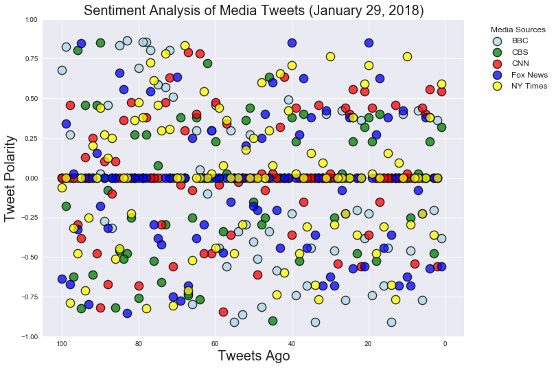
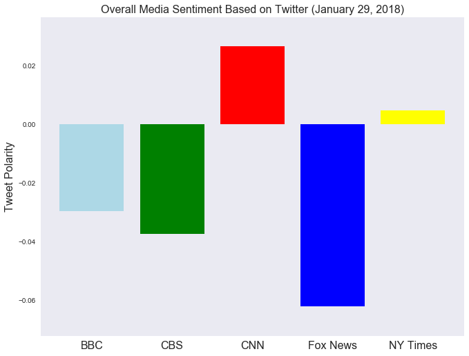

#Analysis

*Examined in total, the tweets, regardless of organization, were close to neutral

*At the time this was run (and it varied as I was testing), Fox News showed the most negative sentiment,
based on compound mean, and CNN the most positive

*All outlets had tweets that were near each extreme (positive or negative), but overall they appeared to balance out
resulting in the mean near zero

#Setup


```python
import json
import tweepy 
import os
import requests
import pandas as pd
import numpy as np
import matplotlib.pyplot as plt
import seaborn as sns
from dateutil import parser

```

#Grab API Keys


```python
file_name = "../../ClassExamples/api_keys.json"
data = json.load(open(file_name))

consumer_key = data['twitter_consumer_key']
consumer_secret = data['twitter_consumer_secret']
access_token = data['twitter_access_token']
access_token_secret = data['twitter_access_token_secret']
```


```python
auth = tweepy.OAuthHandler(consumer_key, consumer_secret)
auth.set_access_token(access_token, access_token_secret)
api = tweepy.API(auth, parser=tweepy.parsers.JSONParser())
```

#Sentiment Analyzer


```python
from vaderSentiment.vaderSentiment import SentimentIntensityAnalyzer
analyzer = SentimentIntensityAnalyzer()
```

#Dataframe and list initialization
#Tweet load
#Vader Analysis


```python
sentiment_df=pd.DataFrame()
sentiment_mean_df=pd.DataFrame()
```


```python
#the various companies have multiple twitter feeds, I selected the one that looked most like their "news" feed

target_user_list = ["@BBCWorld", "@CBSNews", "@CNN", "@FoxNews", "@nytimes"]

tweet_texts = []
tweet_date = []
tweet_count = []
user_list = []

compound_list = []
positive_list = []
neutral_list = []
negative_list = []

compound_mean_list = []
positive_mean_list = []
negative_mean_list = []
neutral_mean_list = []
    
for target_user in target_user_list:
    # Counter
    counter = 1
    compound_sum = 0
    positive_sum = 0
    negative_sum = 0
    neutral_sum = 0
    
    # # Loop through 5 pages of tweets (total 100 tweets)
    for x in range(5):

        # Get all tweets from home feed (for each page specified)
        public_tweets = api.user_timeline(target_user, page=x)
        

        for tweet in public_tweets:
            compound = analyzer.polarity_scores(tweet["text"])["compound"]
            pos = analyzer.polarity_scores(tweet["text"])["pos"]
            neu = analyzer.polarity_scores(tweet["text"])["neu"]
            neg = analyzer.polarity_scores(tweet["text"])["neg"]
  
            # Add each value to the appropriate list
            compound_list.append(compound)
            positive_list.append(pos)
            neutral_list.append(neu)
            negative_list.append(neg)
            tweet_texts.append(tweet["text"])
            tweet_count.append(counter)
            tweet_date.append(tweet["created_at"])
            user_list.append(target_user)

            compound_sum += compound
            positive_sum += pos
            neutral_sum += neu
            negative_sum += neg
            
            counter += 1

    compound_mean_list.append(compound_sum/(counter-1))
    positive_mean_list.append(positive_sum/(counter-1))
    neutral_mean_list.append(neutral_sum/(counter-1))
    negative_mean_list.append(negative_sum/(counter-1)) 
        
sentiment_df["User"] = user_list
sentiment_df["Tweet Number"] = tweet_count
sentiment_df["Tweet Date"] = tweet_date
sentiment_df["Compound"] = compound_list
sentiment_df["Positive"] = positive_list
sentiment_df["Neutral"] = neutral_list
sentiment_df["Negative"] = negative_list

sentiment_mean_df["User"] = target_user_list
sentiment_mean_df["Compound Mean"]=compound_mean_list
sentiment_mean_df["Positive Mean"]=positive_mean_list
sentiment_mean_df["Neutral Mean"]=neutral_mean_list    
sentiment_mean_df["Negative Mean"]=negative_mean_list

```

#Save to CSV & visually inspect


```python
sentiment_df.to_csv("Media_Tweet_Sentiment.csv")
sentiment_df.head()
```


<div>
<style>
    .dataframe thead tr:only-child th {
        text-align: right;
    }

    .dataframe thead th {
        text-align: left;
    }

    .dataframe tbody tr th {
        vertical-align: top;
    }
</style>
<table border="1" class="dataframe">
  <thead>
    <tr style="text-align: right;">
      <th></th>
      <th>User</th>
      <th>Tweet Number</th>
      <th>Tweet Date</th>
      <th>Compound</th>
      <th>Positive</th>
      <th>Neutral</th>
      <th>Negative</th>
    </tr>
  </thead>
  <tbody>
    <tr>
      <th>0</th>
      <td>@BBCWorld</td>
      <td>1</td>
      <td>Mon Jan 29 22:19:40 +0000 2018</td>
      <td>-0.3818</td>
      <td>0.000</td>
      <td>0.755</td>
      <td>0.245</td>
    </tr>
    <tr>
      <th>1</th>
      <td>@BBCWorld</td>
      <td>2</td>
      <td>Mon Jan 29 22:03:43 +0000 2018</td>
      <td>0.3612</td>
      <td>0.328</td>
      <td>0.458</td>
      <td>0.214</td>
    </tr>
    <tr>
      <th>2</th>
      <td>@BBCWorld</td>
      <td>3</td>
      <td>Mon Jan 29 22:02:41 +0000 2018</td>
      <td>-0.2023</td>
      <td>0.000</td>
      <td>0.921</td>
      <td>0.079</td>
    </tr>
    <tr>
      <th>3</th>
      <td>@BBCWorld</td>
      <td>4</td>
      <td>Mon Jan 29 21:46:13 +0000 2018</td>
      <td>0.3818</td>
      <td>0.206</td>
      <td>0.794</td>
      <td>0.000</td>
    </tr>
    <tr>
      <th>4</th>
      <td>@BBCWorld</td>
      <td>5</td>
      <td>Mon Jan 29 20:57:26 +0000 2018</td>
      <td>0.0000</td>
      <td>0.000</td>
      <td>1.000</td>
      <td>0.000</td>
    </tr>
  </tbody>
</table>
</div>


#Check the dataframe holding the mean values


```python
sentiment_mean_df
```


<div>
<style>
    .dataframe thead tr:only-child th {
        text-align: right;
    }

    .dataframe thead th {
        text-align: left;
    }

    .dataframe tbody tr th {
        vertical-align: top;
    }
</style>
<table border="1" class="dataframe">
  <thead>
    <tr style="text-align: right;">
      <th></th>
      <th>User</th>
      <th>Compound Mean</th>
      <th>Positive Mean</th>
      <th>Neutral Mean</th>
      <th>Negative Mean</th>
    </tr>
  </thead>
  <tbody>
    <tr>
      <th>0</th>
      <td>@BBCWorld</td>
      <td>-0.029688</td>
      <td>0.07731</td>
      <td>0.79855</td>
      <td>0.12415</td>
    </tr>
    <tr>
      <th>1</th>
      <td>@CBSNews</td>
      <td>-0.037406</td>
      <td>0.05669</td>
      <td>0.87254</td>
      <td>0.07077</td>
    </tr>
    <tr>
      <th>2</th>
      <td>@CNN</td>
      <td>0.026612</td>
      <td>0.06541</td>
      <td>0.87540</td>
      <td>0.05924</td>
    </tr>
    <tr>
      <th>3</th>
      <td>@FoxNews</td>
      <td>-0.062224</td>
      <td>0.05646</td>
      <td>0.84374</td>
      <td>0.09982</td>
    </tr>
    <tr>
      <th>4</th>
      <td>@nytimes</td>
      <td>0.004836</td>
      <td>0.08682</td>
      <td>0.83454</td>
      <td>0.07866</td>
    </tr>
  </tbody>
</table>
</div>


#Grab a tweet date to use for the plots & check formatting


```python
Tweet_Date = parser.parse(sentiment_df["Tweet Date"][0])

print(f"Date {Tweet_Date:%B %d, %Y}")
```

    Date January 29, 2018
    

#Bubble Chart


```python
sns.set(rc={'figure.figsize':(11,8.5)})

sns.axes_style()

plt.xlim(105, -5)
plt.ylim(-1,1)

plt.title(f"Sentiment Analysis of Media Tweets ({Tweet_Date:%B %d, %Y})", fontsize = 20)
plt.xlabel("Tweets Ago", fontsize = 20)
plt.ylabel("Tweet Polarity", fontsize = 20)

BBC_handle=plt.scatter(sentiment_df.loc[sentiment_df["User"]=="@BBCWorld"]["Tweet Number"],
                       sentiment_df.loc[sentiment_df["User"]=="@BBCWorld"]["Compound"], s=150,
                       marker="o",facecolors="lightblue", edgecolors="black", alpha=0.75, linewidths = 1.5,label="BBC")
CBS_handle=plt.scatter(sentiment_df.loc[sentiment_df["User"]=="@CBSNews"]["Tweet Number"],
                       sentiment_df.loc[sentiment_df["User"]=="@CBSNews"]["Compound"], s=150,
                       marker="o",facecolors="green", edgecolors="black", alpha=0.75, linewidths = 1.5,label="CBS")
CNN_handle=plt.scatter(sentiment_df.loc[sentiment_df["User"]=="@CNN"]["Tweet Number"],
                       sentiment_df.loc[sentiment_df["User"]=="@CNN"]["Compound"], s=150,
                       marker="o",facecolors="red", edgecolors="black", alpha=0.75, linewidths = 1.5,label="CNN")
FoxNews_handle=plt.scatter(sentiment_df.loc[sentiment_df["User"]=="@FoxNews"]["Tweet Number"],
                       sentiment_df.loc[sentiment_df["User"]=="@FoxNews"]["Compound"], s=150,
                       marker="o",facecolors="blue", edgecolors="black", alpha=0.75, linewidths = 1.5,label="Fox News")
NYTimes_handle=plt.scatter(sentiment_df.loc[sentiment_df["User"]=="@nytimes"]["Tweet Number"],
                       sentiment_df.loc[sentiment_df["User"]=="@nytimes"]["Compound"], s=150,
                       marker="o",facecolors="yellow", edgecolors="black", alpha=0.75, linewidths = 1.5,label="NY Times")

plt.legend(handles=[BBC_handle, CBS_handle, CNN_handle, FoxNews_handle, NYTimes_handle],bbox_to_anchor=(1.04,1),
           loc="upper left",title="Media Sources", fontsize = 12)

plt.savefig ("Media Tweet Sentiment Analysis Bubble.png")
plt.show()
```





#Bar Chart


```python
sns.set_style('dark')
labels = ["BBC", "CBS", "CNN", "Fox News", "NY Times"]
colors = ["lightblue", "green", "red", "blue", "yellow"]
x_axis = np.arange(len(labels))
plt.bar(x_axis, sentiment_mean_df["Compound Mean"],color = colors, align="edge")
plt.ylim (min(sentiment_mean_df["Compound Mean"])-.01, max(sentiment_mean_df["Compound Mean"]) + .01)
tick_locations = [value+0.4 for value in x_axis]
plt.xticks(tick_locations, labels,fontsize = 16)
              
plt.title(f"Overall Media Sentiment Based on Twitter ({Tweet_Date:%B %d, %Y})",fontsize = 16)
plt.ylabel("Tweet Polarity",fontsize = 16)

plt.savefig ("Overall Media Tweet Sentiment Analysis BarChart.png")
plt.show()
```




